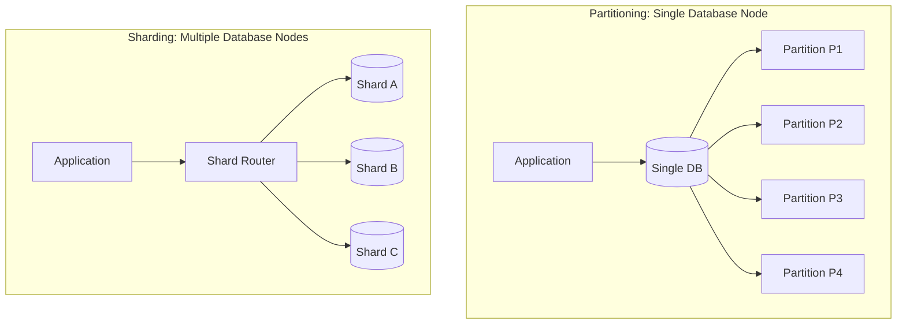
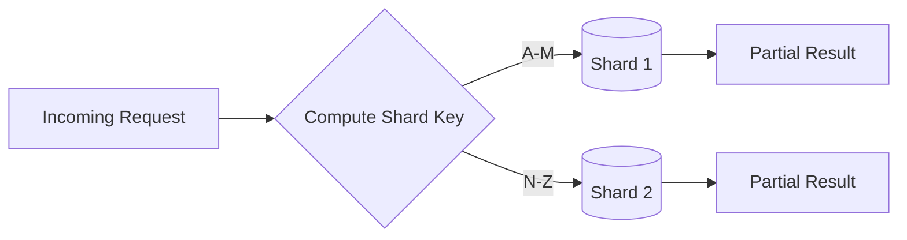
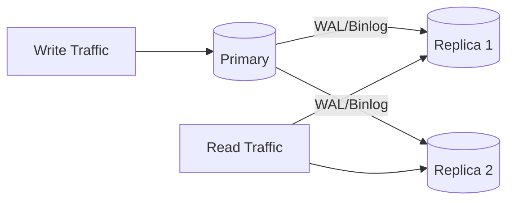

# Database Scaling Interview Questions

---

## Table of Contents

### [Intra-Node Data Distribution](#intra-node-data-distribution)
- [Q1: What is database partitioning and why use it?](#q1)
- [Q2: What are the different types of partitioning?](#q2)

### [Cross-Node Distribution](#cross-node-distribution)
- [Q3: What is the difference between partitioning and sharding?](#q3)
- [Q4: What is database sharding?](#q4)

### [Replication & Availability](#replication--availability)
- [Q5: What is database replication?](#q5)

---

## Intra-Node Data Distribution

<a id="q1"></a>
### Q1: What is database partitioning and why use it?
**Answer:**
Partitioning splits one logical table into smaller physical segments (partitions), typically on the same database cluster, while preserving one table interface for applications.

**Benefits:**
1. **Partition pruning**: optimizer reads only relevant partitions.
2. **Operational simplicity**: archive/drop old data partition-by-partition.
3. **Faster maintenance**: vacuum/reindex/analyze can be partition-scoped.
4. **Improved manageability**: avoids very large monolithic table hotspots.

**What partitioning does not do by itself:** it does not automatically solve all scaling limits or remove need for good indexing.

```sql
-- PostgreSQL partitioned table example
CREATE TABLE orders (
    id SERIAL,
    order_date DATE NOT NULL,
    customer_id INT,
    amount DECIMAL(10,2)
) PARTITION BY RANGE (order_date);

-- Create partitions
CREATE TABLE orders_2023 PARTITION OF orders
    FOR VALUES FROM ('2023-01-01') TO ('2024-01-01');
    
CREATE TABLE orders_2024 PARTITION OF orders
    FOR VALUES FROM ('2024-01-01') TO ('2025-01-01');

-- Query automatically uses partition pruning
SELECT * FROM orders WHERE order_date = '2024-06-15';
-- Only scans orders_2024 partition
```

**Interview pitfall to mention:** if query filters do not include partition key (or predicate is not sargable), pruning may not happen and performance gains disappear.

<a id="q2"></a>
### Q2: What are the different types of partitioning?
**Answer:**

| Type | Description | Best when | Typical downside |
|------|-------------|-----------|------------------|
| **Range** | Partition by value intervals | Time-series data, retention windows | Skew if one range is much hotter |
| **List** | Partition by discrete sets | Regions, tenant tiers, categories | Requires manual mapping updates |
| **Hash** | Partition by hash value | Even write/read distribution | Harder to prune for range queries |
| **Composite** | Mix strategies (e.g., range + hash) | High scale with mixed access patterns | More operational complexity |

**Range Partitioning:**
```sql
-- By date range
CREATE TABLE logs (
    id INT,
    log_date DATE,
    message TEXT
) PARTITION BY RANGE (log_date);

CREATE TABLE logs_jan PARTITION OF logs FOR VALUES FROM ('2024-01-01') TO ('2024-02-01');
CREATE TABLE logs_feb PARTITION OF logs FOR VALUES FROM ('2024-02-01') TO ('2024-03-01');
```

**List Partitioning:**
```sql
-- By region
CREATE TABLE customers (
    id INT,
    name VARCHAR(100),
    region VARCHAR(20)
) PARTITION BY LIST (region);

CREATE TABLE customers_us PARTITION OF customers FOR VALUES IN ('US', 'CA');
CREATE TABLE customers_eu PARTITION OF customers FOR VALUES IN ('UK', 'DE', 'FR');
CREATE TABLE customers_asia PARTITION OF customers FOR VALUES IN ('JP', 'CN', 'KR');
```

**Hash Partitioning:**
```sql
-- Even distribution by user_id
CREATE TABLE user_sessions (
    session_id UUID,
    user_id INT,
    data JSONB
) PARTITION BY HASH (user_id);

CREATE TABLE user_sessions_0 PARTITION OF user_sessions FOR VALUES WITH (MODULUS 4, REMAINDER 0);
CREATE TABLE user_sessions_1 PARTITION OF user_sessions FOR VALUES WITH (MODULUS 4, REMAINDER 1);
CREATE TABLE user_sessions_2 PARTITION OF user_sessions FOR VALUES WITH (MODULUS 4, REMAINDER 2);
CREATE TABLE user_sessions_3 PARTITION OF user_sessions FOR VALUES WITH (MODULUS 4, REMAINDER 3);
```

**Design advice:**
- Pick a partition key aligned with your most common high-volume filters.
- Keep partition count reasonable; too many small partitions increases planner overhead.
- Plan lifecycle automation (create next partition, archive/drop old).

---

## Cross-Node Distribution

<a id="q3"></a>
### Q3: What is the difference between partitioning and sharding?
**Answer:**

| Partitioning | Sharding |
|--------------|----------|
| Single database server | Multiple database servers |
| Logical division | Physical distribution |
| Managed by database | Managed by application/middleware |
| Transparent to application | Application aware of shards |
| Vertical scalability | Horizontal scalability |
| Single point of failure | Distributed, more resilient |



**When to use each:**
- **Partitioning**: Large tables, easier maintenance, query optimization
- **Sharding**: Massive scale, geographic distribution, write scalability

---

<a id="q4"></a>
### Q4: What is database sharding?
**Answer:**
Sharding distributes one logical dataset across multiple independent database instances to scale writes, storage, and throughput beyond one node.

**Strategies:**
1. **Range-based**: Shard by date range, ID range
2. **Hash-based**: Hash of shard key
3. **Directory-based**: Lookup service maps key to shard

**Challenges:**
- Cross-shard queries
- Rebalancing shards
- Maintaining referential integrity
- Increased complexity



**Production considerations:**
- Choose a shard key with high cardinality and even distribution.
- Avoid "hot shards" (for example sequential IDs without hashing).
- Plan resharding early (dual writes, backfill, cutover strategy).
- Use global IDs and avoid cross-shard transactions where possible.

---

## Replication & Availability

<a id="q5"></a>
### Q5: What is database replication?
**Answer:**
Replication copies data from one primary source to one or more replicas for high availability, read scaling, and disaster recovery.

**Types:**
1. **Primary-Replica**: writes to primary, reads can go to replicas.
2. **Multi-primary**: writes accepted on multiple nodes (conflict handling required).
3. **Synchronous**: commit waits for replica ACK (stronger durability, higher latency).
4. **Asynchronous**: primary commits without waiting (faster, but possible replica lag/data loss window).

**Benefits:**
- High availability
- Read scalability
- Disaster recovery
- Geographic distribution



**Interview nuance:** replication improves availability, but it is not a substitute for backups. Logical mistakes (for example accidental delete) replicate too.

---

[← Back to Database Index](README.md)
