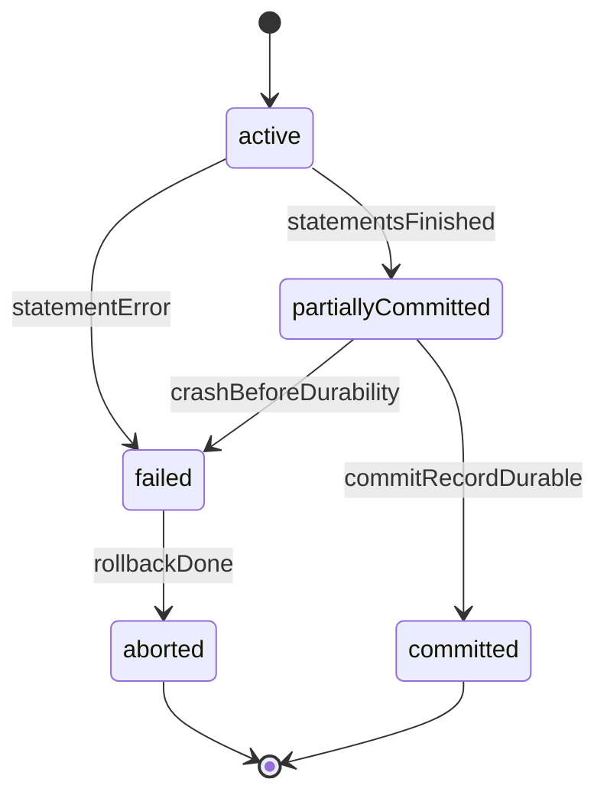
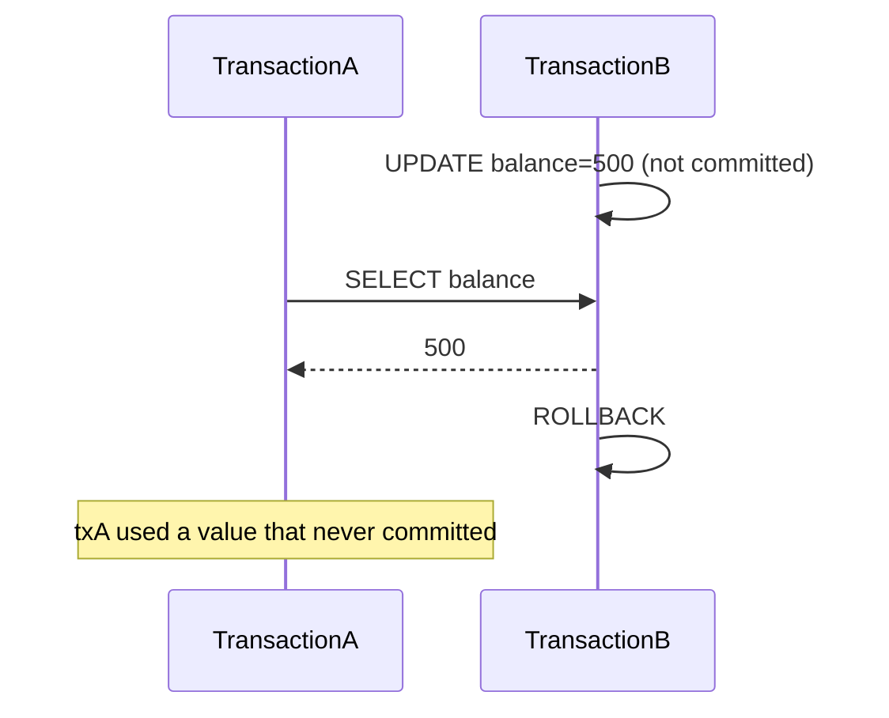
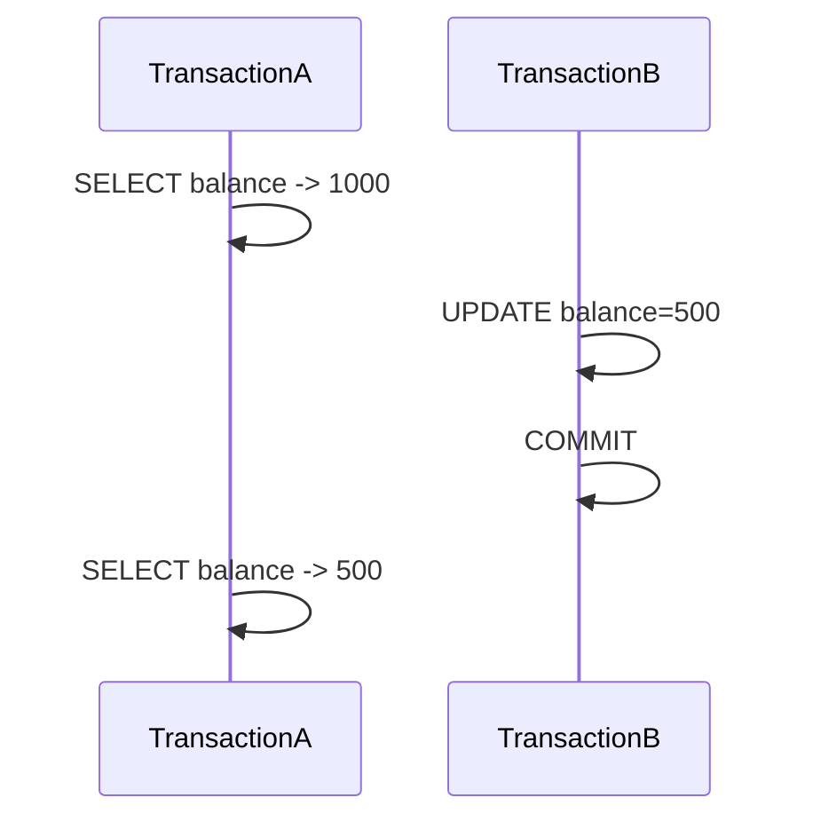
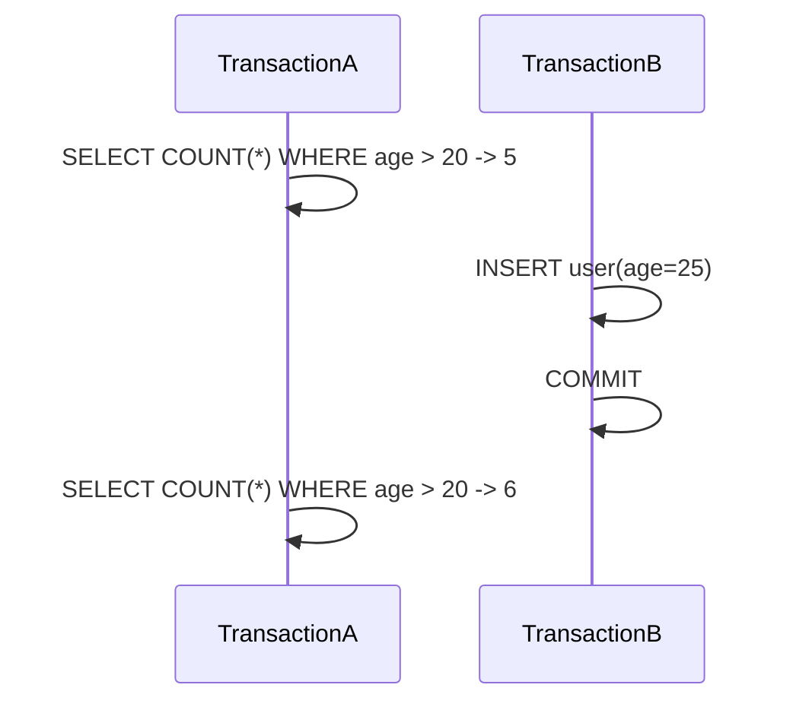
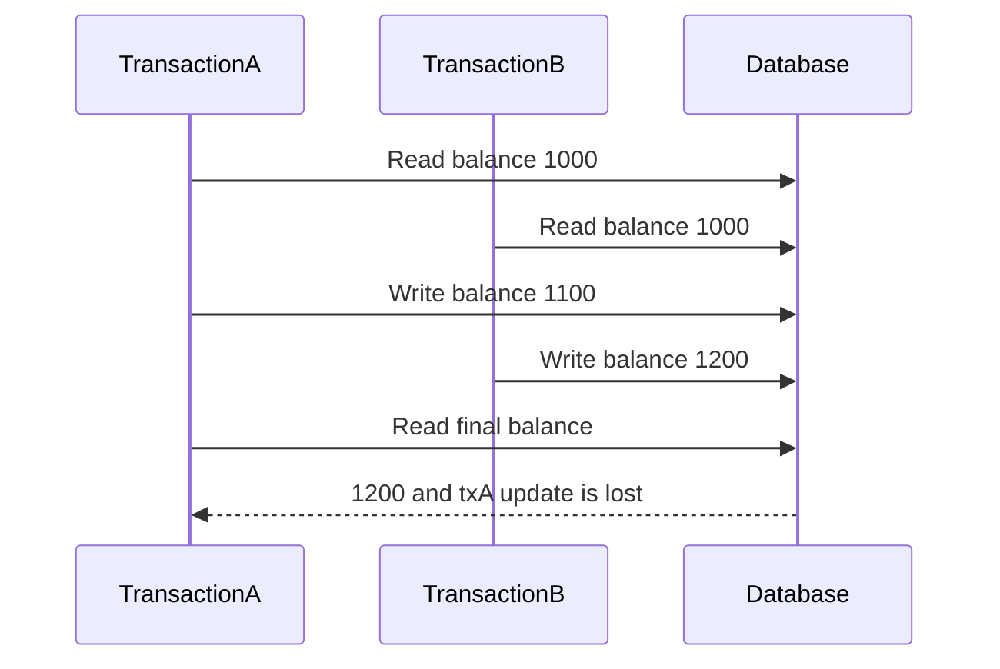
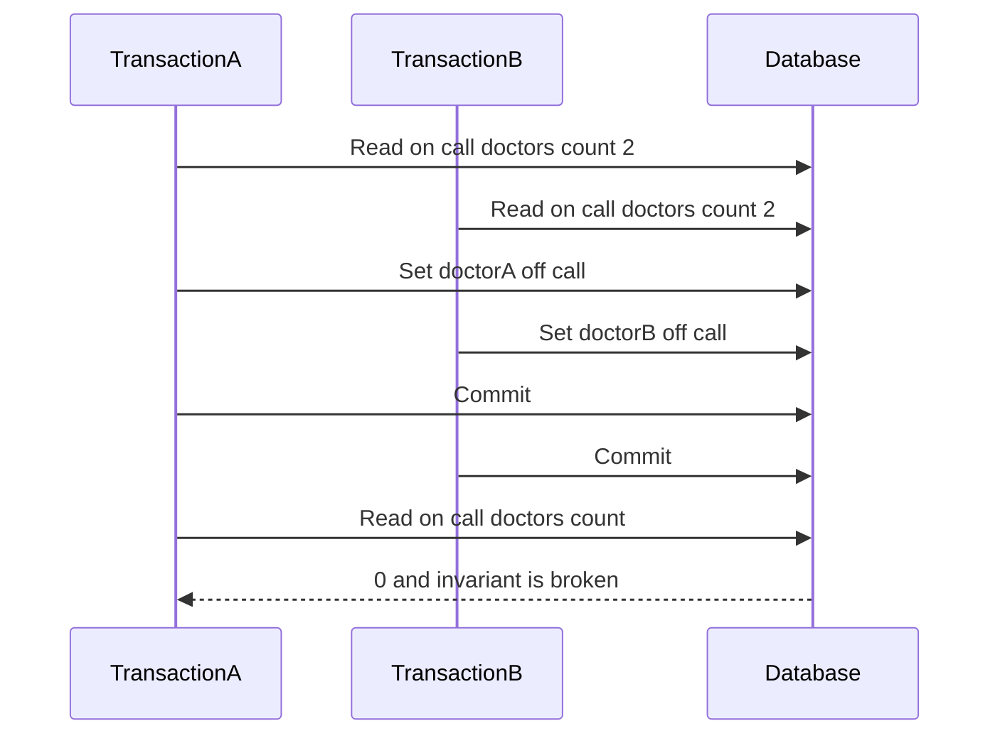
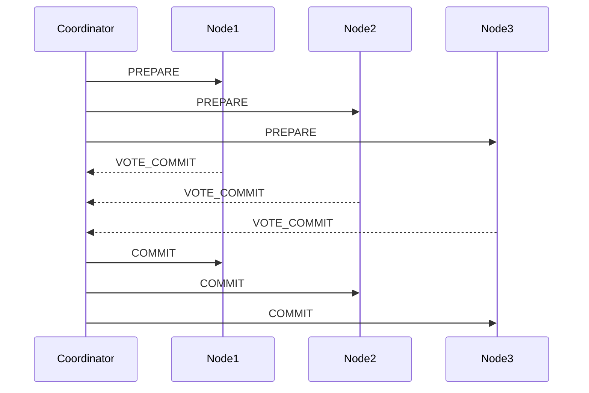
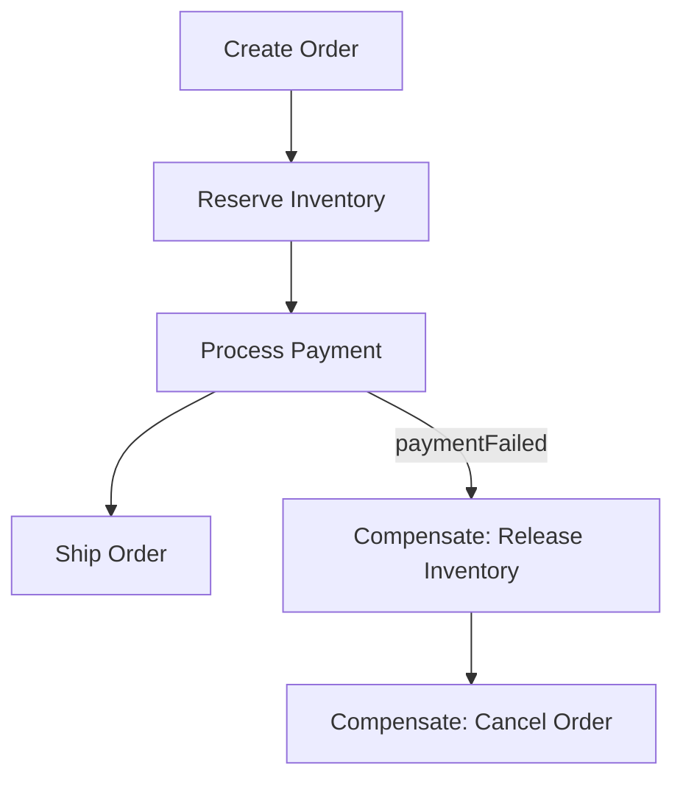
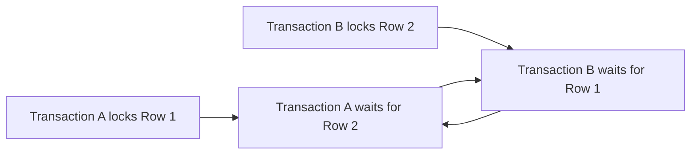

# Database Transactions Interview Questions

---

[Spring Transactional: Propagation and Isolation](https://www.baeldung.com/spring-transactional-propagation-isolation)

[Deep into Transaction](https://viblo.asia/p/deep-into-transaction-PwlVmeK1V5Z)

## Table of Contents

### [Transactions & Isolation Foundations](#transactions--isolation-foundations)
- [Q1: What is a database transaction?](#q1)
- [Q2: What are Dirty Read, Non-Repeatable Read, and Phantom Read?](#q2)
- [Q3: What are the database isolation levels?](#q3)
- [Q4: What is the difference between Read Committed and Read Uncommitted?](#q4)
- [Q5: What is the difference between Repeatable Read and Serializable?](#q5)
- [Q6: How do you choose the right isolation level?](#q6)

### [Advanced Concurrency Anomalies](#advanced-concurrency-anomalies)
- [Q7: What are Lost Update and Write Skew anomalies?](#q7)

### [Transaction Propagation & Savepoints](#transaction-propagation--savepoints)
- [Q8: What is transaction propagation?](#q8)
- [Q9: What are savepoints in transactions?](#q9)

### [Distributed Transactions](#distributed-transactions)
- [Q10: What is the two-phase commit protocol?](#q10)
- [Q11: What are distributed transactions and their challenges?](#q11)

### [Locking](#locking)
- [Q12: What is database locking?](#q12)
- [Q13: What is the difference between optimistic and pessimistic locking?](#q13)
- [Q14: When should you use optimistic vs pessimistic locking?](#q14)
- [Q15: What are the different lock types in databases?](#q15)

### [Deadlocks](#deadlocks)
- [Q16: What is a database deadlock and how can you prevent it?](#q16)

---

## Transactions & Isolation Foundations

<a id="q1"></a>
### Q1: What is a database transaction?
**Answer:**
A transaction is a logical unit of work that is committed as one atomic change-set or fully rolled back.

**Why transactions matter in production:**
- Prevent partial updates across related rows/tables.
- Keep business invariants valid under concurrency.
- Provide crash recovery guarantees.

**ACID recap:**
- **Atomicity:** all statements succeed or none do.
- **Consistency:** constraints and invariants remain valid.
- **Isolation:** concurrent transactions do not corrupt each other.
- **Durability:** committed data survives crashes (via WAL/redo logs).

```sql
BEGIN;
UPDATE accounts SET balance = balance - 100 WHERE id = 1;
UPDATE accounts SET balance = balance + 100 WHERE id = 2;
COMMIT; -- or ROLLBACK on error
```

**Transaction lifecycle (simplified):**


<a id="q2"></a>
### Q2: What are Dirty Read, Non-Repeatable Read, and Phantom Read?
**Answer:**
These are anomalies caused by overlapping transactions observing changing data.

| Anomaly | What happens | Typical level where possible |
|---------|--------------|-------------------------------|
| Dirty Read | Read uncommitted value that may roll back | READ UNCOMMITTED |
| Non-Repeatable Read | Same row read twice returns different committed values | READ COMMITTED |
| Phantom Read | Re-running predicate query returns new/deleted matching rows | READ COMMITTED / some RR implementations |

**Dirty Read example:**


**Non-Repeatable Read example:**


**Phantom Read example:**


<a id="q3"></a>
### Q3: What are the database isolation levels?
**Answer:**
Isolation level controls what one transaction can observe from others.

| Isolation Level | Dirty Read | Non-Repeatable Read | Phantom Read | Concurrency |
|-----------------|------------|---------------------|--------------|-------------|
| READ UNCOMMITTED | Possible | Possible | Possible | Highest |
| READ COMMITTED | Prevented | Possible | Possible | High |
| REPEATABLE READ | Prevented | Prevented | Engine-dependent | Medium |
| SERIALIZABLE | Prevented | Prevented | Prevented | Lowest |

**Engine notes that interviewers like:**
- PostgreSQL maps `READ UNCOMMITTED` to `READ COMMITTED`.
- InnoDB defaults to `REPEATABLE READ`.
- PostgreSQL defaults to `READ COMMITTED`.
- Serializable in PostgreSQL uses SSI (Serializable Snapshot Isolation), not just coarse locking.

```sql
-- Standard SQL style
SET TRANSACTION ISOLATION LEVEL READ COMMITTED;

-- PostgreSQL per transaction
BEGIN TRANSACTION ISOLATION LEVEL SERIALIZABLE;
```

```java
@Transactional(isolation = Isolation.READ_COMMITTED)
public void transferMoney() { }
```

<a id="q4"></a>
### Q4: What is the difference between Read Committed and Read Uncommitted?
**Answer:**

| READ UNCOMMITTED | READ COMMITTED |
|------------------|----------------|
| Can read uncommitted data | Reads only committed data |
| Vulnerable to dirty reads | Prevents dirty reads |
| Rare in OLTP production | Default for many production systems |
| Slightly lower read coordination | Safer semantics with small overhead |

**Practical implication:**
- `READ UNCOMMITTED` can return values that are rolled back later.
- `READ COMMITTED` gives statement-level consistency, but repeated reads can still change.

```sql
-- Transaction A
BEGIN;
UPDATE products SET price = 100 WHERE id = 1; -- uncommitted

-- Transaction B (READ COMMITTED)
SELECT price FROM products WHERE id = 1; -- sees old committed value or waits
```

**When to mention RU:** mostly legacy/reporting scenarios where exact correctness is not critical.

<a id="q5"></a>
### Q5: What is the difference between Repeatable Read and Serializable?
**Answer:**

| REPEATABLE READ | SERIALIZABLE |
|-----------------|--------------|
| Stable row snapshots within transaction | Equivalent to some serial order |
| Often enough for many OLTP flows | Strongest correctness guarantee |
| Better throughput | Highest contention/retry risk |
| Can still allow serialization anomalies (for example write skew) | Prevents write skew and predicate anomalies |

**Example anomaly under weaker isolation (write skew):**
- Two doctors both read "at least one doctor must stay on call".
- Each transaction updates a different row to `off_call`.
- Both commit; invariant is violated.

Serializable prevents this class of anomaly by conflict detection or stronger predicate locking.

<a id="q6"></a>
### Q6: How do you choose the right isolation level?
**Answer:**
Pick the lowest isolation level that still protects your business invariants.

| Use Case | Typical Choice | Why |
|----------|----------------|-----|
| Bank transfer / ledger posting | SERIALIZABLE (or strict locking) | No tolerance for anomalies |
| Checkout / inventory reservation | REPEATABLE READ + explicit locks | Balance correctness and throughput |
| General CRUD web APIs | READ COMMITTED | Good default for many services |
| Analytics dashboards | READ COMMITTED / snapshot reads | Throughput over strict point-in-time guarantees |

**Decision checklist:**
1. What invariant must never break?
2. How often do transactions touch same rows/ranges?
3. What is acceptable retry rate?
4. Is optimistic retry logic already in place?

**Good engineering pattern:** keep most requests at `READ COMMITTED`, and isolate only high-risk flows (payment, inventory, seat booking) with stronger control.

---

## Advanced Concurrency Anomalies

<a id="q7"></a>
### Q7: What are Lost Update and Write Skew anomalies?
**Answer:**

**Lost Update:** two writers overwrite each other because both started from the same old value.



**Write Skew:** transactions update different rows after reading shared predicate state; final combined result violates rule.



**Prevention strategies:**
- `SELECT ... FOR UPDATE` on critical rows/ranges.
- Optimistic version checks (`WHERE version = ?`) + retry.
- SERIALIZABLE for invariant-critical workflows.

```sql
-- Optimistic lock pattern
UPDATE accounts
SET balance = :newBalance, version = version + 1
WHERE id = :id AND version = :oldVersion;
```

---

## Transaction Propagation & Savepoints

<a id="q8"></a>
### Q8: What is transaction propagation?
**Answer:**
Propagation controls how a transactional method behaves when called inside another transactional context (especially in Spring).

| Propagation | Behavior |
|-------------|----------|
| REQUIRED | Join existing transaction or create new |
| REQUIRES_NEW | Always create a new transaction, suspending current one |
| SUPPORTS | Join if exists, run non-transactionally otherwise |
| NOT_SUPPORTED | Suspend existing transaction, run without one |
| MANDATORY | Must run inside an existing transaction |
| NEVER | Must run without transaction |
| NESTED | Create savepoint-style nested boundary |

```java
@Transactional // REQUIRED by default
public void createOrder(Order order) {
    orderRepository.save(order);
    paymentService.charge(order); // joins same transaction by default
}

@Transactional(propagation = Propagation.REQUIRES_NEW)
public void writeAuditLog(AuditEntry entry) {
    auditRepository.save(entry); // commits independently
}
```

**Interview nuance:** propagation settings only apply when call goes through Spring proxy (self-invocation caveat).

<a id="q9"></a>
### Q9: What are savepoints in transactions?
**Answer:**
Savepoints allow partial rollback inside a single transaction.

```sql
BEGIN;
INSERT INTO orders (id, customer_id) VALUES (1, 100);

SAVEPOINT before_items;

INSERT INTO order_items (order_id, product_id) VALUES (1, 'PROD1');
INSERT INTO order_items (order_id, product_id) VALUES (1, 'PROD2');

-- If item insert fails:
ROLLBACK TO SAVEPOINT before_items;

INSERT INTO order_items (order_id, product_id) VALUES (1, 'PROD3');
COMMIT;
```

**Use cases:**
- Batch processing where some records may fail.
- Multi-step flows where core entity should persist even if optional steps fail.
- Emulating nested transaction behavior where DB/framework supports it.

---

## Distributed Transactions

<a id="q10"></a>
### Q10: What is the two-phase commit protocol?
**Answer:**
Two-phase commit (2PC) is a coordination protocol to make all participants either commit or abort together.

**Phase 1 (Prepare/Vote):**
1. Coordinator sends `PREPARE`.
2. Participants persist intent and reply `VOTE_COMMIT` or `VOTE_ABORT`.

**Phase 2 (Decision):**
1. If all vote commit -> coordinator sends `COMMIT`.
2. Otherwise -> coordinator sends `ABORT`.



**Drawbacks interviewers expect:**
- Blocking if coordinator crashes.
- Long lock holding and higher latency.
- Sensitive to partitions and partial failures.

So modern microservices often prefer saga/outbox over strict distributed ACID.

<a id="q11"></a>
### Q11: What are distributed transactions and their challenges?
**Answer:**
Distributed transactions span multiple services/datastores that must reach a consistent business outcome.

**Main challenges:**
- Network and partial failures.
- Different data models/transaction semantics.
- Long-running flows and compensation complexity.
- Observability/debugging across boundaries.

**Common patterns:**
1. **Saga** (choreography/orchestration with compensating actions)
2. **Outbox** (reliable event publication with local transaction)
3. **TCC** (Try-Confirm-Cancel reservation flow)

**Saga example:**


**Outbox pattern core idea:**
```sql
BEGIN;
INSERT INTO orders (id, status) VALUES (1, 'CREATED');
INSERT INTO outbox (event_type, payload) VALUES ('OrderCreated', '{"id":1}');
COMMIT;
```

Publisher service later reads outbox rows and publishes to Kafka/RabbitMQ with retry and idempotency.

---

## Locking

<a id="q12"></a>
### Q12: What is database locking?
**Answer:**
Locking coordinates concurrent access so writes do not violate consistency.

**Why locks exist:**
- Prevent lost updates.
- Enforce isolation semantics.
- Protect read-modify-write critical sections.

| Granularity | Concurrency | Overhead | Typical use |
|-------------|-------------|----------|-------------|
| Database | Lowest | Lowest | Maintenance operations |
| Table | Low | Low | Bulk changes, migrations |
| Page | Medium | Medium | Engine-level internal strategy |
| Row | Highest | Highest | OLTP transactions |

```sql
-- Row-level lock for update
SELECT * FROM accounts WHERE id = 1 FOR UPDATE;

-- Shared lock (engine-specific behavior)
SELECT * FROM accounts WHERE id = 1 FOR SHARE;
```

**Interview depth point:** MVCC reduces reader-writer blocking, but writes still need lock/conflict coordination.

<a id="q13"></a>
### Q13: What is the difference between optimistic and pessimistic locking?
**Answer:**

| Optimistic Locking | Pessimistic Locking |
|--------------------|---------------------|
| Assumes conflicts are rare | Assumes conflicts are likely |
| No lock while reading | Acquire lock before update |
| Detects conflict at write/commit | Prevents concurrent conflicting writes |
| Requires retry on conflict | Can block/wait and increase contention |
| Great for read-heavy workloads | Better for high-contention critical paths |

**Optimistic example (`@Version`):**
```java
@Entity
public class Account {
    @Id
    private Long id;

    @Version
    private Long version;
}
```

**Pessimistic example:**
```sql
BEGIN;
SELECT * FROM accounts WHERE id = 1 FOR UPDATE;
UPDATE accounts SET balance = balance - 100 WHERE id = 1;
COMMIT;
```

<a id="q14"></a>
### Q14: When should you use optimistic vs pessimistic locking?
**Answer:**

| Scenario | Better choice | Why |
|----------|---------------|-----|
| User profile updates | Optimistic | Low conflict, high read concurrency |
| Product catalog edits | Optimistic | Occasional collisions; retries acceptable |
| Inventory decrement for flash sale | Pessimistic | High contention, must avoid oversell |
| Bank transfer ledger rows | Pessimistic or SERIALIZABLE | Correctness over throughput |
| Seat reservation | Pessimistic | Race conditions are expensive |

**Practical rule:**
- Start optimistic for normal CRUD.
- Switch selective paths to pessimistic where conflict rate or inconsistency cost is high.

```java
@Retryable(value = OptimisticLockingFailureException.class, maxAttempts = 3)
@Transactional
public void credit(Long id, BigDecimal amount) {
    Account account = repository.findById(id).orElseThrow();
    account.setBalance(account.getBalance().add(amount));
    repository.save(account);
}
```

<a id="q15"></a>
### Q15: What are the different lock types in databases?
**Answer:**

| Lock Type | Description | Compatible With |
|-----------|-------------|-----------------|
| Shared (S) | Read lock | Other Shared/Intent Shared |
| Exclusive (X) | Write lock | None |
| Update (U) | Intent to upgrade S -> X | Shared (engine-dependent) |
| Intent Shared (IS) | Plans shared lock at lower level | IS, IX, S |
| Intent Exclusive (IX) | Plans exclusive lock at lower level | IS, IX |

**Compatibility snapshot (simplified):**

| Requested \\ Held | S | X | IS | IX |
|-------------------|---|---|----|----|
| S | Yes | No | Yes | No |
| X | No | No | No | No |
| IS | Yes | No | Yes | Yes |
| IX | No | No | Yes | Yes |

**PostgreSQL row lock examples:**
```sql
SELECT * FROM accounts FOR SHARE;
SELECT * FROM accounts FOR UPDATE;
SELECT * FROM accounts FOR NO KEY UPDATE;
SELECT * FROM accounts FOR KEY SHARE;

-- Useful for worker queues
SELECT * FROM jobs
WHERE status = 'pending'
FOR UPDATE SKIP LOCKED
LIMIT 1;
```

---

## Deadlocks

<a id="q16"></a>
### Q16: What is a database deadlock and how can you prevent it?
**Answer:**
A deadlock happens when transactions wait on each other in a cycle, and none can proceed.



Databases detect deadlocks and abort one transaction (deadlock victim) so the other can continue.

**Prevention strategies:**
1. Access rows/tables in a consistent global order.
2. Keep transactions short and focused.
3. Lock only what you need, as late as possible.
4. Add retry logic for deadlock/serialization failures.
5. Use appropriate indexes so locks touch fewer rows.

**Operational best practice:** instrument deadlock logs and alert on spikes; frequent deadlocks usually indicate access-order or index design issues.

---

[← Back to Database Index](README.md)
