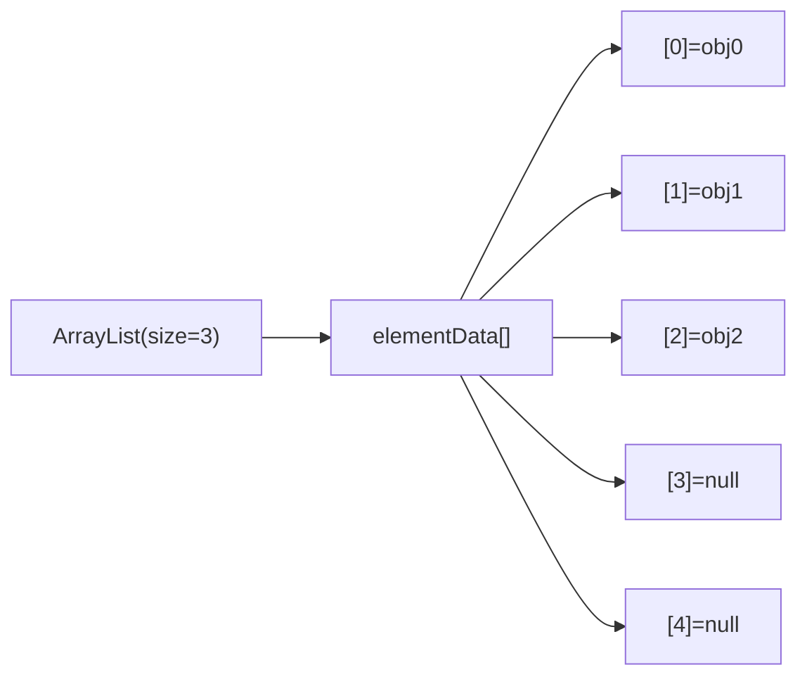
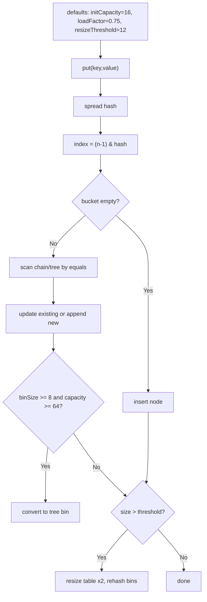
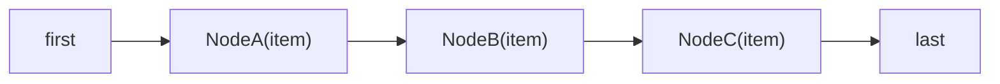
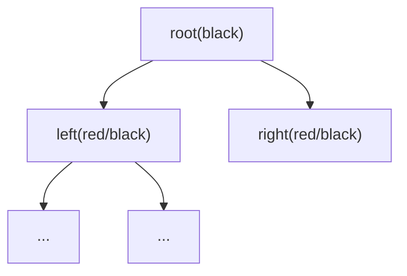

# Collections & Data Structures

## Table of Contents

### Data Structures Overview
- [Q1: What are the main differences between ArrayList and LinkedList?](#q1)
- [Q2: What is the difference between HashMap and TreeMap?](#q2)
- [Q3: What is the difference between HashSet, LinkedHashSet, and TreeSet?](#q3)
- [Q4: What happens when two keys have the same hashCode in HashMap?](#q4)
- [Q5: Why should you override both hashCode() and equals()?](#q5)

### Collections Internals
- [Q6: How does ArrayList work internally?](#q6)
- [Q7: How does HashMap work internally?](#q7)
- [Q8: How does ConcurrentHashMap work internally?](#q8)
- [Q9: How does LinkedList work internally?](#q9)
- [Q10: How does TreeMap work internally?](#q10)

---

## Data Structures Overview

<a id="q1"></a>
### Q1: What are the main differences between ArrayList and LinkedList?
**Answer:**
| ArrayList | LinkedList |
|-----------|------------|
| Backed by dynamic array | Backed by doubly-linked nodes |
| O(1) random access by index | O(n) random access |
| Appending is O(1) amortized | Appending/removing at ends is O(1) |
| Insert/remove in middle is O(n) (shifts) | Insert/remove near known node is O(1), but lookup is O(n) |
| Better cache locality, usually faster in practice | Higher per-element memory overhead |

**Deep-dive trade-off:**  
`LinkedList` is often chosen for "fast inserts", but in real code you usually pay O(n) traversal before insertion. For most workloads, `ArrayList` wins because of CPU cache friendliness.

<a id="q2"></a>
### Q2: What is the difference between HashMap and TreeMap?
**Answer:**
| HashMap | TreeMap |
|---------|---------|
| Hash-table buckets | Red-Black Tree |
| Average O(1) get/put | O(log n) get/put |
| No key order guarantee | Sorted by natural order or `Comparator` |
| Allows one null key | Null key not allowed (natural ordering path) |
| Best for fast key lookup | Best for ordered queries (`floorKey`, `subMap`) |

Use `TreeMap` when you need sorted traversal/range queries; otherwise `HashMap` is usually the default.

<a id="q3"></a>
### Q3: What is the difference between HashSet, LinkedHashSet, and TreeSet?
**Answer:**
| Set Type | Ordering | Complexity | Null | Backing structure |
|----------|----------|------------|------|-------------------|
| `HashSet` | Unordered | O(1) average | One null | `HashMap` |
| `LinkedHashSet` | Insertion order | O(1) average | One null | `LinkedHashMap` |
| `TreeSet` | Sorted | O(log n) | Not allowed with natural ordering | `TreeMap` |

**When to pick which:**
- `HashSet`: fastest membership checks.
- `LinkedHashSet`: deduplicate while preserving insertion order.
- `TreeSet`: need sorted + navigational operations (`ceiling`, `floor`).

<a id="q4"></a>
### Q4: What happens when two keys have the same hashCode in HashMap?
**Answer:**
A hash collision means multiple keys map to the same bucket index.

HashMap resolution flow:
1. Compute spread hash (`h ^ (h >>> 16)`).
2. Pick bucket via bit mask (`(n - 1) & hash`).
3. If bucket occupied, compare keys via `equals()`.
4. Chain in linked bin; in Java 8+, convert to tree bin when collision depth crosses threshold.

Important Java 8+ thresholds:
- `TREEIFY_THRESHOLD = 8`
- `UNTREEIFY_THRESHOLD = 6`
- `MIN_TREEIFY_CAPACITY = 64` (otherwise map resizes first instead of treeifying)

**Why this matters:** even with many collisions, worst-case operations improve from O(n) to O(log n) once treeified.

<a id="q5"></a>
### Q5: Why should you override both hashCode() and equals()?
**Answer:**
`HashMap`/`HashSet` rely on both methods:
- `hashCode()` chooses the bucket.
- `equals()` confirms logical key equality inside that bucket.

Contract:
- If `a.equals(b)` is true, `a.hashCode() == b.hashCode()` must be true.
- Reverse is not required (collisions are allowed).

```java
final class Person {
    private final String email;

    Person(String email) { this.email = email; }

    @Override
    public boolean equals(Object o) {
        if (this == o) return true;
        if (!(o instanceof Person p)) return false;
        return Objects.equals(email, p.email);
    }

    @Override
    public int hashCode() {
        return Objects.hash(email);
    }
}
```

**Pitfall:** mutable fields in `hashCode()/equals()` can make map entries "disappear" after mutation.

---

## Collections Internals

<a id="q6"></a>
### Q6: How does ArrayList work internally?
**Answer:**
`ArrayList` stores elements in an `Object[]` and tracks logical size separately.

Key defaults (OpenJDK):
- No-arg constructor starts with a shared empty array (lazy allocation).
- First insertion expands to default capacity `10`.
- Growth factor is roughly `1.5x` when resize is needed.

```java
public class ArrayList<E> {
    transient Object[] elementData;
    private int size;
}
```

Growth behavior (OpenJDK): when full, capacity grows roughly by 1.5x.

```java
int newCapacity = oldCapacity + (oldCapacity >> 1);
```



Complexity caveats:
- `add(e)` is O(1) amortized, but resize step is O(n).
- `add(index, e)` and `remove(index)` shift elements (O(n)).
- Iterator is fail-fast (best-effort) via `modCount`.

<a id="q7"></a>
### Q7: How does HashMap work internally?
**Answer:**
`HashMap` uses an array of buckets (`Node[] table`). Each bucket can hold:
- single node,
- linked chain of nodes,
- red-black tree bin (high collision case).

Core fields:
```java
transient Node<K,V>[] table;
int threshold;          // capacity * loadFactor
final float loadFactor; // default 0.75
```

Key defaults (no-arg constructor):
- `defaultInitialCapacity = 16`
- `defaultLoadFactor = 0.75`
- `defaultResizeThreshold = 12` (computed as `16 * 0.75`)
- Treeification context: `TREEIFY_THRESHOLD = 8`, `UNTREEIFY_THRESHOLD = 6`, `MIN_TREEIFY_CAPACITY = 64`

Put flow:
1. Compute spread hash.
2. Find index using bitmask.
3. Insert/update in bin.
4. Resize if `size > threshold`.



**Performance note:** good key hash distribution is critical; poor hash functions increase collisions and latency variance.

<a id="q8"></a>
### Q8: How does ConcurrentHashMap work internally?
**Answer:**
`ConcurrentHashMap` (Java 8+) avoids whole-map locks:
- Reads are mostly non-blocking (volatile/atomic reads).
- Writes use CAS where possible, then synchronize at bin level when contended.
- Supports lock-free style atomic APIs (`compute`, `merge`, `putIfAbsent`).

```java
ConcurrentHashMap<String, Integer> counters = new ConcurrentHashMap<>();
counters.merge("ok", 1, Integer::sum); // atomic update
```

Internal behavior highlights:
- No `null` keys or values (avoids ambiguity in concurrent reads).
- Buckets can become tree bins like HashMap under heavy collisions.
- Resizing is cooperative: multiple threads help transfer buckets.

**Pitfall:** `size()` under contention may be approximate during concurrent updates; avoid assuming strict snapshot semantics without external coordination.

<a id="q9"></a>
### Q9: How does LinkedList work internally?
**Answer:**
`LinkedList` is a doubly-linked list with `first` and `last` pointers.

```java
private static class Node<E> {
    E item;
    Node<E> next;
    Node<E> prev;
}
```



Operational behavior:
- `addFirst/addLast/removeFirst/removeLast`: O(1)
- `get(index)` and indexed insert/remove: O(n)
- Iterator removal is efficient once positioned at node

Use `LinkedList` mainly when deque-style operations dominate; for index-heavy access, prefer `ArrayList`.

<a id="q10"></a>
### Q10: How does TreeMap work internally?
**Answer:**
`TreeMap` is implemented as a Red-Black Tree (self-balancing BST).

Red-Black properties keep height bounded (~`log n`), so `get/put/remove` remain O(log n).



Key points:
- Ordering is by natural key order or provided `Comparator`.
- Supports navigational APIs: `firstKey`, `higherKey`, `floorEntry`, `subMap`.
- Great for range queries and sorted traversals.

```java
NavigableMap<Integer, String> map = new TreeMap<>();
map.put(3, "three");
map.put(1, "one");
map.put(2, "two");

Integer floor = map.floorKey(2); // 2
SortedMap<Integer, String> sub = map.subMap(1, 3); // [1,3)
```

---

[← Back to Java Index](README.md)
