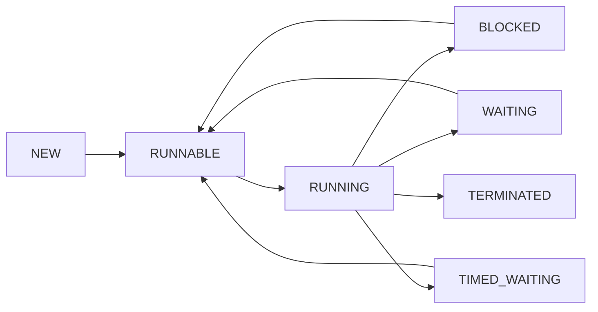
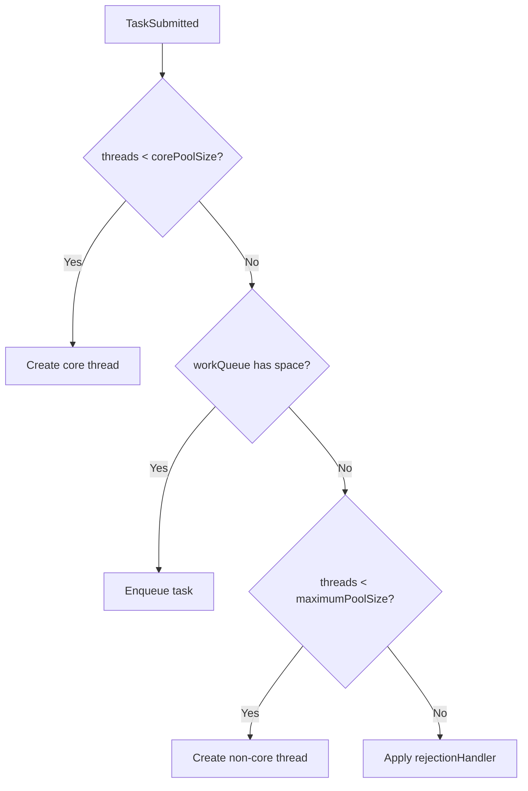

# Concurrency & Multithreading

[Introduction to Thread Pools in Java - Baeldung](https://www.baeldung.com/thread-pool-java-and-guava)

## Table of Contents

### Thread Basics
- [Q1: What is a Thread and what is its lifecycle?](#q1)
- [Q2: What are the different ways to create a thread?](#q2)
- [Q3: What is the difference between Runnable and Callable?](#q3)
- [Q4: What is the difference between wait() and sleep()?](#q4)

### Synchronization
- [Q5: What is the difference between synchronized and volatile?](#q5)
- [Q6: What is thread synchronization and what are the types of locks?](#q6)
- [Q7: What is a deadlock and how can you prevent it?](#q7)
- [Q8: What is the difference between notify() and notifyAll()?](#q8)

### Thread Pools
- [Q9: What are Thread Pools and why use them?](#q9)
- [Q10: What are the different types of thread pools and when to use each?](#q10)
- [Q11: What are the parameters of ThreadPoolExecutor?](#q11)
- [Q12: What are the rejection policies in ThreadPoolExecutor?](#q12)
- [Q13: What is the difference between execute() and submit()?](#q13)
- [Q14: What is the difference between Executor and ExecutorService?](#q14)
- [Q15: How do you properly shutdown a thread pool?](#q15)
- [Q16: What is the difference between scheduleAtFixedRate and scheduleWithFixedDelay?](#q16)
- [Q17: What is ForkJoinPool and how does it work?](#q17)

### Concurrency Utilities
- [Q18: What are the concurrency utilities in java.util.concurrent?](#q18)
- [Q19: What is a CountDownLatch, CyclicBarrier, and Semaphore?](#q19)

### Atomic Operations
- [Q20: What are Atomic classes and when should you use them?](#q20)
- [Q21: What is Compare-And-Swap (CAS)?](#q21)

### Memory
- [Q22: What is the difference between Heap and Stack memory?](#q22)
- [Q23: What is a memory leak in Java and how can you prevent it?](#q23)
- [Q24: What is the difference between StackOverflowError and OutOfMemoryError?](#q24)

---

## Thread Basics

<a id="q1"></a>
### Q1: What is a Thread and what is its lifecycle?
**Answer:**
A thread is the smallest schedulable unit of execution inside a process. Threads in one JVM process share heap memory but have separate stacks.



| State | Typical transition trigger |
|-------|----------------------------|
| NEW | `new Thread(...)` |
| RUNNABLE | `start()` called, waiting for CPU |
| BLOCKED | waiting to enter synchronized section |
| WAITING | `wait()`, `join()` (no timeout) |
| TIMED_WAITING | `sleep()`, timed wait/join |
| TERMINATED | `run()` exits or uncaught error |

**Interview note:** In Java, RUNNABLE can include runnable + running at OS level.

<a id="q2"></a>
### Q2: What are the different ways to create a thread?
**Answer:**
Common approaches:

1. Extend `Thread` (simple but less flexible).
2. Implement `Runnable` (preferred for task separation).
3. Use `Callable` with `ExecutorService` (returns value and supports checked exceptions).
4. Submit tasks to an `ExecutorService`/thread pool.

```java
// Runnable
Thread t = new Thread(() -> doWork());
t.start();

// Callable
ExecutorService pool = Executors.newFixedThreadPool(4);
Future<Integer> future = pool.submit(() -> 42);
int result = future.get();
pool.shutdown();
```

**Production preference:** Use executors, not raw threads, for bounded resource management and observability.

<a id="q3"></a>
### Q3: What is the difference between Runnable and Callable?
**Answer:**
| Runnable | Callable<V> |
|----------|-------------|
| `run()` | `call()` |
| No return value | Returns value of type `V` |
| Cannot throw checked exceptions | Can throw checked exceptions |
| Used with `Thread` or executor | Used with executor |

```java
Callable<String> task = () -> {
    if (Thread.currentThread().isInterrupted()) {
        throw new IOException("interrupted");
    }
    return "done";
};
```

Use `Runnable` for fire-and-forget jobs; use `Callable` when result/failure propagation matters.

<a id="q4"></a>
### Q4: What is the difference between wait() and sleep()?
**Answer:**
| `wait()` | `sleep()` |
|----------|-----------|
| Method on `Object` | Static method on `Thread` |
| Must be called while holding monitor | Can be called anywhere |
| Releases monitor lock | Does not release lock |
| Resumes by `notify/notifyAll` or interrupt | Resumes after timeout or interrupt |

```java
synchronized (lock) {
    while (!ready) {
        lock.wait(); // releases lock so producer can acquire it
    }
}
```

**Pitfall:** Always use `wait()` in a `while` loop to guard against spurious wakeups.

---

## Synchronization

<a id="q5"></a>
### Q5: What is the difference between synchronized and volatile?
**Answer:**
| `synchronized` | `volatile` |
|----------------|------------|
| Mutual exclusion + visibility | Visibility + ordering only |
| Locks monitor, may block threads | Non-blocking reads/writes |
| Works for compound operations | Not safe for read-modify-write |
| Higher contention cost | Lower overhead for simple flags |

```java
class Counter {
    private int value;
    synchronized void inc() { value++; } // atomic under lock
}

class StopSignal {
    volatile boolean stop;
}
```

Use `volatile` for state publication flags, `synchronized` (or locks) for invariants across multiple fields.

<a id="q6"></a>
### Q6: What is thread synchronization and what are the types of locks?
**Answer:**
Synchronization coordinates shared-state access to prevent races and preserve invariants.

| Lock Type | Strength | Typical use |
|-----------|----------|-------------|
| Intrinsic lock (`synchronized`) | Simple, JVM-managed | General critical sections |
| `ReentrantLock` | Try-lock, timeout, fairness options | Fine control and explicit lock management |
| `ReadWriteLock` | Many readers, single writer | Read-heavy structures |
| `StampedLock` | Optimistic reads | High-read, low-write paths |

```java
private final ReentrantLock lock = new ReentrantLock();

void update() {
    lock.lock();
    try {
        // critical section
    } finally {
        lock.unlock();
    }
}
```

**Pitfall:** Forgetting `unlock()` in `finally` can deadlock the system.

<a id="q7"></a>
### Q7: What is a deadlock and how can you prevent it?
**Answer:**
Deadlock is a permanent wait cycle where threads hold resources and wait for each other indefinitely.

**Four conditions (all required):**
1. Mutual exclusion
2. Hold and wait
3. No preemption
4. Circular wait

**Prevention strategies:**
- Global lock ordering (always lock A then B).
- Use `tryLock(timeout)` and fallback.
- Keep critical sections short.
- Avoid nested locks when possible.
- Prefer higher-level concurrent structures (`BlockingQueue`, `ConcurrentHashMap`).

```java
Lock first = id1 < id2 ? lock1 : lock2;
Lock second = id1 < id2 ? lock2 : lock1;
```

<a id="q8"></a>
### Q8: What is the difference between notify() and notifyAll()?
**Answer:**
| `notify()` | `notifyAll()` |
|------------|---------------|
| Wakes one waiting thread | Wakes all waiting threads |
| Lower wake-up overhead | Safer when multiple wait conditions exist |
| Risk of waking wrong waiter | Reduced missed-signal risk |

Prefer `notifyAll()` unless you can prove one wait-condition queue and safe single wakeup behavior.

---

## Thread Pools

<a id="q9"></a>
### Q9: What are Thread Pools and why use them?
**Answer:**
A thread pool reuses worker threads to execute many tasks, instead of creating a thread per task.

**Why pools are important:**
- Avoid expensive thread creation/destruction per request.
- Bound concurrency to protect CPU and memory.
- Improve latency consistency under load.
- Offer instrumentation hooks (queue size, active threads, rejects).

**Operational benefit:** Pools are where backpressure happens; without bounds, overload becomes outage.

<a id="q10"></a>
### Q10: What are the different types of thread pools and when to use each?
**Answer:**
| Type | Good for | Risk |
|------|----------|------|
| `newFixedThreadPool(n)` | Stable throughput with bounded workers | Unbounded queue by default |
| `newCachedThreadPool()` | Burst of many short tasks | Unbounded threads (resource exhaustion) |
| `newSingleThreadExecutor()` | Ordered single-worker processing | Throughput bottleneck |
| `newScheduledThreadPool(n)` | Delayed/periodic tasks | Long tasks can delay schedule |
| `newWorkStealingPool()` | CPU-bound fork/join tasks | Less predictable for blocking tasks |

**Production recommendation:** Prefer custom `ThreadPoolExecutor` with bounded queue and explicit rejection policy.

<a id="q11"></a>
### Q11: What are the parameters of ThreadPoolExecutor?
**Answer:**
```java
ThreadPoolExecutor executor = new ThreadPoolExecutor(
    corePoolSize,
    maximumPoolSize,
    keepAliveTime,
    timeUnit,
    workQueue,
    threadFactory,
    rejectionHandler
);
```

**Meaning of parameters:**
- `corePoolSize`: baseline workers kept alive.
- `maximumPoolSize`: upper thread cap under saturation.
- `workQueue`: buffers tasks before extra thread growth.
- `keepAliveTime`: timeout for non-core idle threads.
- `threadFactory`: naming, priorities, uncaught exception handler.
- `rejectionHandler`: behavior when saturated.



```java
ThreadPoolExecutor ioPool = new ThreadPoolExecutor(
    8,
    32,
    60L, TimeUnit.SECONDS,
    new ArrayBlockingQueue<>(500),
    r -> new Thread(r, "io-worker"),
    new ThreadPoolExecutor.CallerRunsPolicy()
);
```

<a id="q12"></a>
### Q12: What are the rejection policies in ThreadPoolExecutor?
**Answer:**
When queue is full and max threads are reached, one policy applies:

| Policy | Behavior | Typical use |
|--------|----------|-------------|
| `AbortPolicy` | throws `RejectedExecutionException` | fail fast |
| `CallerRunsPolicy` | caller executes task | natural backpressure |
| `DiscardPolicy` | silently drops task | only for lossy workloads |
| `DiscardOldestPolicy` | drops oldest queued task | niche queue-refresh scenarios |

**Best practice:** Log/metric every rejection event and define explicit business behavior.

<a id="q13"></a>
### Q13: What is the difference between execute() and submit()?
**Answer:**
| `execute(Runnable)` | `submit(...)` |
|---------------------|---------------|
| Returns `void` | Returns `Future` |
| For fire-and-forget | For result/cancellation tracking |
| Exceptions go to uncaught handler | Exceptions are wrapped in `ExecutionException` via `Future#get()` |

```java
executor.execute(() -> process());      // no Future
Future<Integer> f = executor.submit(() -> compute());
int value = f.get();
```

Use `submit` when caller needs completion/result/error propagation.

<a id="q14"></a>
### Q14: What is the difference between Executor and ExecutorService?
**Answer:**
| Executor | ExecutorService |
|----------|-----------------|
| Minimal interface: only `execute` | Full lifecycle + result APIs |
| No shutdown methods | `shutdown`, `shutdownNow`, `awaitTermination` |
| No batch submit support | `submit`, `invokeAll`, `invokeAny` |

`Executor` is a contract; `ExecutorService` is operationally useful in real systems.

<a id="q15"></a>
### Q15: How do you properly shutdown a thread pool?
**Answer:**
Use graceful shutdown first, then force shutdown if timeout expires.

```java
pool.shutdown(); // stop accepting new tasks
try {
    if (!pool.awaitTermination(30, TimeUnit.SECONDS)) {
        List<Runnable> dropped = pool.shutdownNow(); // interrupt running tasks
        System.out.println("Dropped: " + dropped.size());
    }
} catch (InterruptedException e) {
    pool.shutdownNow();
    Thread.currentThread().interrupt();
}
```

**Pitfall:** forgetting shutdown in apps/tests causes thread leaks and hanging JVM exits.

<a id="q16"></a>
### Q16: What is the difference between scheduleAtFixedRate and scheduleWithFixedDelay?
**Answer:**
| Method | Next run starts |
|--------|-----------------|
| `scheduleAtFixedRate` | based on initial schedule time (attempts fixed cadence) |
| `scheduleWithFixedDelay` | delay counted after previous run completes |

```java
ScheduledExecutorService ses = Executors.newScheduledThreadPool(2);
ses.scheduleAtFixedRate(this::poll, 0, 5, TimeUnit.SECONDS);
ses.scheduleWithFixedDelay(this::cleanup, 0, 5, TimeUnit.SECONDS);
```

Use fixed rate for heartbeat metrics; fixed delay for variable-duration maintenance tasks.

<a id="q17"></a>
### Q17: What is ForkJoinPool and how does it work?
**Answer:**
`ForkJoinPool` is designed for divide-and-conquer CPU-bound tasks with work-stealing.

**How it works:**
1. Task splits into subtasks (`fork`).
2. Worker executes local deque tasks.
3. Idle workers steal tasks from others.
4. Results combine (`join`).

```java
class SumTask extends RecursiveTask<Long> {
    private final long[] arr;
    private final int start, end;
    SumTask(long[] arr, int start, int end) { this.arr = arr; this.start = start; this.end = end; }

    @Override
    protected Long compute() {
        if (end - start <= 10_000) {
            long sum = 0;
            for (int i = start; i < end; i++) sum += arr[i];
            return sum;
        }
        int mid = (start + end) >>> 1;
        SumTask left = new SumTask(arr, start, mid);
        SumTask right = new SumTask(arr, mid, end);
        left.fork();
        long rightResult = right.compute();
        return rightResult + left.join();
    }
}
```

**Avoid for blocking I/O** unless using managed blockers.

---

## Concurrency Utilities

<a id="q18"></a>
### Q18: What are the concurrency utilities in java.util.concurrent?
**Answer:**
Key utility groups:

| Category | Examples | Problem solved |
|----------|----------|----------------|
| Executors | `ExecutorService`, `ScheduledExecutorService` | Task execution and pooling |
| Synchronizers | `CountDownLatch`, `CyclicBarrier`, `Semaphore` | Coordination between threads |
| Concurrent collections | `ConcurrentHashMap`, `CopyOnWriteArrayList`, `BlockingQueue` | Safe shared collections |
| Atomics | `AtomicInteger`, `AtomicReference`, `LongAdder` | Lock-free atomic operations |
| Locks | `ReentrantLock`, `ReadWriteLock`, `StampedLock` | Advanced lock semantics |

Use these first before writing custom low-level synchronization.

<a id="q19"></a>
### Q19: What is a CountDownLatch, CyclicBarrier, and Semaphore?
**Answer:**
| Utility | Core idea | Reusable |
|---------|-----------|----------|
| `CountDownLatch` | one/many threads wait until counter reaches zero | No |
| `CyclicBarrier` | fixed number of threads wait for each other at barrier point | Yes |
| `Semaphore` | controls number of concurrent permits | Yes |

```java
CountDownLatch latch = new CountDownLatch(3);
for (int i = 0; i < 3; i++) {
    pool.submit(() -> { doPart(); latch.countDown(); });
}
latch.await(); // continue only after all three parts finish
```

Use latch for one-time startup gates, barrier for iterative phase synchronization, semaphore for limiting access (for example DB connections).

---

## Atomic Operations

<a id="q20"></a>
### Q20: What are Atomic classes and when should you use them?
**Answer:**
Atomic classes provide lock-free thread-safe operations on single variables using CAS.

Common classes:
- `AtomicInteger`, `AtomicLong`, `AtomicBoolean`
- `AtomicReference<T>`
- High-contention counters: `LongAdder`, `LongAccumulator`

```java
AtomicInteger retries = new AtomicInteger(0);
int current = retries.incrementAndGet();
```

Use atomics for simple shared counters/flags/references. For multi-field invariants, use locks or transactional structures.

<a id="q21"></a>
### Q21: What is Compare-And-Swap (CAS)?
**Answer:**
CAS is an atomic CPU-level primitive:
1. Read current value.
2. If it equals expected value, write new value.
3. Otherwise fail and retry.

```java
AtomicInteger value = new AtomicInteger(10);
boolean updated = value.compareAndSet(10, 11); // true
```

**Pros:** avoids lock contention in many scenarios.  
**Pitfalls:** spinning under heavy contention, and ABA problem (especially for pointer-like state, solved with stamped references).

---

## Memory

<a id="q22"></a>
### Q22: What is the difference between Heap and Stack memory?
**Answer:**
| Heap | Stack |
|------|-------|
| Shared across threads | One stack per thread |
| Stores objects and arrays | Stores method frames, local primitives, references |
| Managed by GC | Auto-managed by call push/pop |
| Larger, slower access than stack | Small and fast, but limited |

Objects live in heap; local references to those objects live in stack frames.

<a id="q23"></a>
### Q23: What is a memory leak in Java and how can you prevent it?
**Answer:**
A Java memory leak means objects are still reachable but no longer useful, so GC cannot reclaim them.

Typical causes:
- Static collections that keep growing.
- Caches without eviction.
- Listeners/callbacks not deregistered.
- ThreadLocal values not removed in pooled threads.

```java
private static final Map<String, byte[]> CACHE = new HashMap<>(); // leak risk
```

Prevention:
- Use bounded caches (size/time eviction).
- Remove listeners and clear ThreadLocal in `finally`.
- Avoid unnecessary object retention in long-lived singletons.
- Monitor heap with profilers and memory metrics.

<a id="q24"></a>
### Q24: What is the difference between StackOverflowError and OutOfMemoryError?
**Answer:**
| StackOverflowError | OutOfMemoryError |
|--------------------|------------------|
| Thread stack exhausted | JVM cannot allocate required memory |
| Commonly from deep/infinite recursion | Heap/metaspace/direct-memory pressure |
| Usually one thread fails | Can destabilize whole process |

```java
void recurse() { recurse(); } // StackOverflowError
```

`OutOfMemoryError` variants include heap space, metaspace, direct buffer memory, and unable-to-create-new-native-thread.

---

[← Back to Java Index](README.md)
