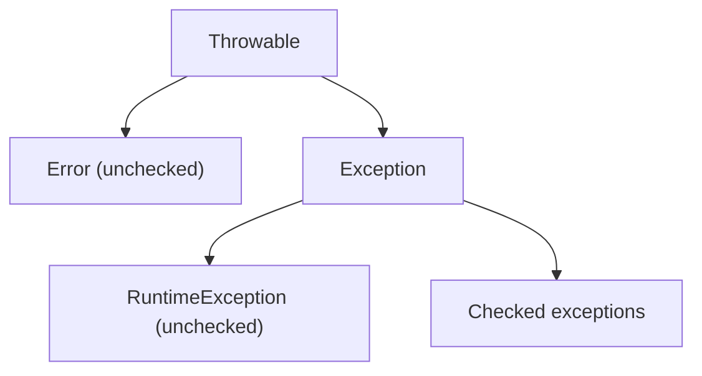

# Java Core Fundamentals

## Table of Contents

### OOP (Object-Oriented Programming)
- [Q1: What are the four pillars of OOP?](#q1)
- [Q2: What is the difference between method overloading and method overriding?](#q2)
- [Q3: What is the difference between == and .equals()?](#q3)

### Interfaces and Abstract Classes
- [Q4: What is the difference between Interface and Abstract Class?](#q4)
- [Q5: When would you use an interface vs an abstract class?](#q5)
- [Q6: What are default methods in interfaces (Java 8+)?](#q6)

### Keywords
- [Q7: What is the static keyword used for?](#q7)
- [Q8: What are the uses of the final keyword?](#q8)
- [Q9: What is the difference between final, finally, and finalize()?](#q9)
- [Q10: What does the volatile keyword do?](#q10)

### Generics
- [Q11: What are generics and why use them?](#q11)
- [Q12: What is type erasure?](#q12)
- [Q13: What are bounded type parameters and wildcards?](#q13)
- [Q14: What is the difference between <? extends T> and <? super T>?](#q14)
- [Q15: What is the difference between bounded type parameter and bounded wildcard?](#q15)
- [Q16: When should we use bounded type parameter vs bounded wildcard?](#q16)

### Exception Handling
- [Q17: What is the difference between checked and unchecked exceptions?](#q17)
- [Q18: What is the difference between throw and throws?](#q18)
- [Q19: What is exception chaining?](#q19)
- [Q20: How do you handle multiple exceptions?](#q20)
- [Q21: What is exception propagation?](#q21)

### Serialization
- [Q22: What is serialization and deserialization?](#q22)
- [Q23: What is the transient keyword?](#q23)
- [Q24: What is serialVersionUID?](#q24)
- [Q25: What is the difference between Serializable and Externalizable?](#q25)

### Immutability
- [Q26: What is an immutable class and how do you create one?](#q26)
- [Q27: Why is String immutable in Java?](#q27)

### OOP Principles
- [Q28: What are the SOLID principles?](#q28)
- [Q29: What are the GRASP principles?](#q29)

---

## OOP (Object-Oriented Programming)

<a id="q1"></a>
### Q1: What are the four pillars of OOP?
**Answer:**
The four pillars are ways to design code so domain behavior is organized, reusable, and easier to change safely.

1. **Encapsulation**  
   Keep data and behavior together, and hide internal state behind methods.
2. **Inheritance**  
   Reuse behavior by deriving specialized types from base types.
3. **Polymorphism**  
   Program to abstractions so the same call works with different implementations.
4. **Abstraction**  
   Expose only what callers need (contract), hide implementation details.

```java
interface PaymentProcessor {
    Receipt pay(Money amount);
}

final class CardProcessor implements PaymentProcessor {
    @Override
    public Receipt pay(Money amount) { return new Receipt("card", amount); }
}

final class UpiProcessor implements PaymentProcessor {
    @Override
    public Receipt pay(Money amount) { return new Receipt("upi", amount); }
}
```

**Interview follow-up:** In production, prefer composition over deep inheritance trees because inheritance often increases coupling and fragile base-class bugs.

<a id="q2"></a>
### Q2: What is the difference between method overloading and method overriding?
**Answer:**
| Overloading | Overriding |
|-------------|------------|
| Same method name, different parameter list | Same signature in parent and child |
| Resolved at compile time | Resolved at runtime (dynamic dispatch) |
| Usually in same class | Across inheritance hierarchy |
| Return type can differ if params differ | Return type must be same or covariant |
| Can overload `static` methods | `static`, `private`, and `final` methods are not overridden |

```java
class Printer {
    void print(String s) {}           // overloaded
    void print(int n) {}              // overloaded
}

class Animal {
    Number speed() { return 10; }
}
class Dog extends Animal {
    @Override
    Integer speed() { return 20; }    // covariant return
}
```

**Pitfall:** Overloading can be confusing with `null` and primitive widening/boxing; always keep overload sets simple.

<a id="q3"></a>
### Q3: What is the difference between `==` and `.equals()`?
**Answer:**
- `==` compares primitive values, or object references (same object identity).
- `.equals()` compares logical/value equality when overridden correctly.

```java
String a = new String("java");
String b = new String("java");
String c = "java";

System.out.println(a == b);       // false (different objects)
System.out.println(a.equals(b));  // true  (same content)
System.out.println(c == "java");  // true  (string pool)
```

**Design rule:** If you override `.equals()`, also override `.hashCode()` to preserve hash-based collection correctness.

---

## Interfaces and Abstract Classes

<a id="q4"></a>
### Q4: What is the difference between Interface and Abstract Class?
**Answer:**
| Interface | Abstract Class |
|-----------|----------------|
| Defines contract-first API | Defines common base behavior + state |
| Multiple inheritance of type | Single class inheritance |
| Fields are implicitly `public static final` | Can have instance fields of any visibility |
| Best for capability roles (`Sortable`, `Cacheable`) | Best for shared base implementation |
| Can have `default`/`static` methods (Java 8+) | Can have constructors and full implementation control |

```java
interface Retryable {
    default int maxRetries() { return 3; }
}

abstract class BaseClient {
    protected final HttpClient httpClient;
    protected BaseClient(HttpClient httpClient) { this.httpClient = httpClient; }
}
```

<a id="q5"></a>
### Q5: When would you use an interface vs an abstract class?
**Answer:**
**Use an interface when:**
- You want a stable contract used by unrelated classes.
- You need multiple inheritance of behavior contracts.
- You want to decouple implementation from usage (clean architecture, test doubles).

**Use an abstract class when:**
- Subclasses share state and invariant logic.
- You want template methods and protected helper methods.
- You need constructor enforcement for common dependencies.

**Practical rule:** Start with interface for public contracts; introduce abstract base only when duplicated implementation appears.

<a id="q6"></a>
### Q6: What are default methods in interfaces (Java 8+)?
**Answer:**
Default methods let interfaces evolve without breaking existing implementations.

```java
interface Auditable {
    default String actor() { return "system"; }
}
```

**Why they exist:**
- Preserve backward compatibility when adding methods to old interfaces.
- Enable library evolution (for example, many Java collection enhancements).

**Diamond conflict rule:**
- If two interfaces provide same default method, implementing class must override explicitly.

```java
interface A { default String name() { return "A"; } }
interface B { default String name() { return "B"; } }

class C implements A, B {
    @Override
    public String name() {
        return A.super.name();
    }
}
```

---

## Keywords

<a id="q7"></a>
### Q7: What is the `static` keyword used for?
**Answer:**
`static` belongs to the class, not an instance.

- **Static field:** shared state (`Math.PI` style constants).
- **Static method:** utility-style behavior without object state.
- **Static block:** one-time class initialization.
- **Static nested class:** nested type without outer instance reference.

```java
class IdGenerator {
    private static long counter = 0;
    static synchronized long nextId() { return ++counter; }
}
```

**Pitfall:** Mutable static state is global state; it complicates testing and concurrency.

<a id="q8"></a>
### Q8: What are the uses of the `final` keyword?
**Answer:**
- **`final` variable:** assigned once.
- **`final` parameter:** cannot be reassigned in method body.
- **`final` method:** cannot be overridden.
- **`final` class:** cannot be subclassed.

```java
final class Money {
    private final long cents;
    Money(long cents) { this.cents = cents; }
}
```

**Deep dive:** `final` references do not make the object immutable; they only prevent reference reassignment.

<a id="q9"></a>
### Q9: What is the difference between `final`, `finally`, and `finalize()`?
**Answer:**
| Item | Meaning | Typical use |
|------|---------|-------------|
| `final` | Language keyword for non-extensible/one-time assignment | Constants, immutable fields, API safety |
| `finally` | `try` block companion executed regardless of exception | Resource cleanup when not using try-with-resources |
| `finalize()` | Old GC callback in `Object` | **Deprecated and unreliable; avoid** |

```java
try {
    useResource();
} finally {
    cleanup();
}
```

Use `AutoCloseable` + try-with-resources instead of `finalize()`.

<a id="q10"></a>
### Q10: What does the `volatile` keyword do?
**Answer:**
`volatile` gives **visibility + ordering guarantees** for a field across threads:
- Writes by one thread become visible to other threads quickly.
- Prevents certain instruction reordering around that field.
- Does **not** make compound operations atomic (`count++` is still unsafe).

```java
class Worker {
    private volatile boolean running = true;
    void stop() { running = false; }
    void loop() {
        while (running) {
            // do work
        }
    }
}
```

Use `volatile` for state flags; use locks or `Atomic*` for read-modify-write operations.

---

## Generics

<a id="q11"></a>
### Q11: What are generics and why use them?
**Answer:**
Generics provide compile-time type safety and reusable APIs without runtime casts.

**Benefits:**
1. Catch type mismatches at compile time.
2. Eliminate fragile downcasts.
3. Enable generic data structures and algorithms.

```java
List<String> names = new ArrayList<>();
names.add("A");
// names.add(1); // compile error
String first = names.get(0);
```

**Interview detail:** Java generics are invariant (`List<Integer>` is not a subtype of `List<Number>`), which leads to wildcard usage (`extends` / `super`).

<a id="q12"></a>
### Q12: What is type erasure?
**Answer:**
Java compiles generic types by erasing type parameters and inserting casts/bridges where needed.

```java
List<String> a = new ArrayList<>();
List<Integer> b = new ArrayList<>();
System.out.println(a.getClass() == b.getClass()); // true
```

**Consequences of erasure:**
- No `new T()` or `T.class` directly.
- Cannot overload methods that differ only by generic parameter.
- Runtime `instanceof` checks with concrete type parameters are not supported (`obj instanceof List<String>` is illegal).

**Trade-off:** Backward compatibility with pre-generics bytecode, at the cost of richer runtime type info.

<a id="q13"></a>
### Q13: What are bounded type parameters and wildcards?
**Answer:**
- **Bounded type parameter:** constrain a type variable declaration (`<T extends Number>`).
- **Bounded wildcard:** constrain type at usage site (`List<? extends Number>`).

```java
public <T extends Number> double sum(List<T> values) {
    return values.stream().mapToDouble(Number::doubleValue).sum();
}
```

Use type parameters when you must name and reuse the same type variable; use wildcards when only variance is needed at API boundaries.

<a id="q14"></a>
### Q14: What is the difference between `<? extends T>` and `<? super T>`?
**Answer:**
This is the PECS rule: **Producer Extends, Consumer Super**.

| Form | Safe operation | Typical use |
|------|----------------|-------------|
| `? extends T` | Read as `T` | Source/producer collection |
| `? super T` | Write `T` values | Destination/consumer collection |

```java
void copy(List<? extends Number> src, List<? super Number> dest) {
    for (Number n : src) {
        dest.add(n);
    }
}
```

You cannot safely `add` to `List<? extends T>` because the concrete subtype is unknown.

<a id="q15"></a>
### Q15: What is the difference between bounded type parameter and bounded wildcard?
**Answer:**
| Bounded Type Parameter | Bounded Wildcard |
|------------------------|------------------|
| Declares a named type variable (`<T extends X>`) | Uses anonymous placeholder (`? extends X`) |
| Reusable across return/params | Local to one position |
| Can model relationship between arguments | Does not model cross-argument relationship |
| Supports multiple bounds (`<T extends A & B>`) | Single bound only |

```java
// relationship between inputs and output is explicit via T
public <T extends Comparable<T>> T max(T a, T b) {
    return a.compareTo(b) >= 0 ? a : b;
}
```

<a id="q16"></a>
### Q16: When should we use bounded type parameter vs bounded wildcard?
**Answer:**
**Use bounded type parameter when:**
- The same type appears in multiple places (input + output).
- You need to express relationships between parameters.
- You need intersection bounds.

**Use bounded wildcard when:**
- You are designing a flexible API boundary.
- The type is used in one place only.
- You care about read/write variance (PECS).

```java
// wildcard-based API boundary: clear intent
double average(List<? extends Number> values) {
    return values.stream().mapToDouble(Number::doubleValue).average().orElse(0.0);
}
```

---

## Exception Handling

<a id="q17"></a>
### Q17: What is the difference between checked and unchecked exceptions?
**Answer:**
| Checked Exceptions | Unchecked Exceptions |
|--------------------|---------------------|
| Must be handled or declared | Optional to catch |
| Compile-time enforcement | Runtime failures |
| Usually recoverable external problems | Usually programming defects or invariant violations |
| Examples: `IOException`, `SQLException` | Examples: `NullPointerException`, `IllegalArgumentException` |



**Guideline:** Use checked exceptions for recoverable boundaries (I/O, remote calls) and unchecked exceptions for programming contract violations.

<a id="q18"></a>
### Q18: What is the difference between throw and throws?
**Answer:**
| `throw` | `throws` |
|--------|----------|
| Throws an exception instance now | Declares what method may throw |
| Inside method body | In method signature |
| One exception object at a time | Can list multiple exception types |

```java
void validateAge(int age) {
    if (age < 0) {
        throw new IllegalArgumentException("age must be >= 0");
    }
}

String load(Path path) throws IOException {
    return Files.readString(path);
}
```

<a id="q19"></a>
### Q19: What is exception chaining?
**Answer:**
Exception chaining wraps lower-level exceptions in domain-level exceptions while keeping root cause.

```java
class UserImportException extends RuntimeException {
    UserImportException(String message, Throwable cause) {
        super(message, cause);
    }
}

void importUsers(Path path) {
    try {
        // parse + save
    } catch (IOException e) {
        throw new UserImportException("Failed to import users from " + path, e);
    }
}
```

**Why it matters:** Better abstraction at service boundaries, while preserving debuggability via `getCause()`.

<a id="q20"></a>
### Q20: How do you handle multiple exceptions?
**Answer:**
Use a combination of:
- **Multi-catch** when handling logic is the same.
- **Specific catch blocks** before generic ones.
- **try-with-resources** to avoid manual cleanup bugs.
- **Centralized translation** at API boundaries.

```java
try (BufferedReader br = Files.newBufferedReader(path)) {
    return br.readLine();
} catch (NoSuchFileException e) {
    throw new IllegalArgumentException("Input file missing", e);
} catch (IOException e) {
    throw new UncheckedIOException("I/O failure", e);
}
```

**Pitfall:** Catching `Exception` too early hides real failures and makes retry logic unsafe.

<a id="q21"></a>
### Q21: What is exception propagation?
**Answer:**
Propagation means an exception bubbles up call stack frames until caught.

```java
void c() { throw new IllegalStateException("boom"); }
void b() { c(); }
void a() { b(); } // unless caught here, runtime ends with stack trace
```

**Design insight:** Catch exceptions where you can add context or recover; otherwise let them propagate to a global handler (for example, REST exception mapper).

---

## Serialization

<a id="q22"></a>
### Q22: What is serialization and deserialization?
**Answer:**
- **Serialization:** convert object state to byte stream.
- **Deserialization:** reconstruct object from byte stream.

```java
class User implements Serializable {
    private static final long serialVersionUID = 1L;
    String name;
}
```

**Real-world usage:** Caching snapshots, messaging payloads, and legacy session replication.  
**Caution:** Java native serialization has security and compatibility risks; many systems prefer JSON/Avro/Protobuf.

<a id="q23"></a>
### Q23: What is the transient keyword?
**Answer:**
`transient` excludes a field from Java serialization.

```java
class Session implements Serializable {
    String userId;
    transient String authToken; // will not be serialized
}
```

Use it for secrets, non-serializable dependencies, and recomputable fields.

<a id="q24"></a>
### Q24: What is serialVersionUID?
**Answer:**
`serialVersionUID` is a version identifier used by Java serialization runtime to validate class compatibility.

```java
class Order implements Serializable {
    private static final long serialVersionUID = 2L;
}
```

If sender and receiver class versions mismatch, deserialization may fail with `InvalidClassException`.

**Best practice:** Declare it explicitly for stable serialized types.

<a id="q25"></a>
### Q25: What is the difference between Serializable and Externalizable?
**Answer:**
| Serializable | Externalizable |
|--------------|----------------|
| Default Java serialization mechanism | Full manual serialization control |
| Minimal code | Must implement `writeExternal` and `readExternal` |
| Easier but less control | More control and potentially better performance |
| Serializes non-transient fields automatically | You decide exactly what is written |

```java
class Product implements Externalizable {
    private String id;
    private int version;

    @Override
    public void writeExternal(ObjectOutput out) throws IOException {
        out.writeUTF(id);
        out.writeInt(version);
    }

    @Override
    public void readExternal(ObjectInput in) throws IOException {
        id = in.readUTF();
        version = in.readInt();
    }
}
```

---

## Immutability

<a id="q26"></a>
### Q26: What is an immutable class and how do you create one?
**Answer:**
An immutable class cannot change state after construction.

**Checklist:**
1. Class is `final` (or constructors tightly controlled).
2. Fields are `private final`.
3. No setters or mutating methods.
4. Defensive copy on mutable input/output.

```java
public final class Address {
    private final String city;
    private final List<String> lines;

    public Address(String city, List<String> lines) {
        this.city = city;
        this.lines = List.copyOf(lines); // defensive copy
    }

    public String city() { return city; }
    public List<String> lines() { return lines; } // unmodifiable
}
```

**Benefit:** Thread-safety by design and easier reasoning in concurrent code.

<a id="q27"></a>
### Q27: Why is String immutable in Java?
**Answer:**
`String` immutability enables:
- **Security:** classpath, file paths, SQL keys cannot be silently altered.
- **String pool sharing:** safe interning and memory reuse.
- **Hash caching:** stable hash code for fast map lookups.
- **Thread safety:** sharing across threads with no locking.

**Trade-off:** Frequent concatenation in loops can allocate many objects; use `StringBuilder` for mutable assembly.

---

## OOP Principles

<a id="q28"></a>
### Q28: What are the SOLID principles?
**Answer:**
SOLID is a set of maintainability rules for OO design:

1. **S - Single Responsibility:** one reason to change per class.
2. **O - Open/Closed:** open for extension, closed for modification.
3. **L - Liskov Substitution:** subtype must preserve parent behavior contracts.
4. **I - Interface Segregation:** avoid forcing clients to depend on methods they do not use.
5. **D - Dependency Inversion:** depend on abstractions, not concrete details.

```java
interface PaymentGateway { void charge(Money amount); }

class CheckoutService {
    private final PaymentGateway gateway;
    CheckoutService(PaymentGateway gateway) { this.gateway = gateway; }
    void checkout(Money amount) { gateway.charge(amount); }
}
```

**Interview signal:** Explain SOLID with trade-offs; over-abstracting too early can make simple code harder to follow.

<a id="q29"></a>
### Q29: What are the GRASP principles?
**Answer:**
GRASP (General Responsibility Assignment Software Patterns) helps assign responsibilities to classes.

| Principle | Deep intent |
|-----------|-------------|
| Information Expert | Place behavior where data needed for it already exists |
| Creator | Create objects in the class that aggregates/uses them |
| Controller | Handle system events in an application/service boundary object |
| Low Coupling | Reduce ripple effects of change |
| High Cohesion | Keep related behavior together |
| Polymorphism | Replace condition-heavy branching with type-specific behavior |
| Pure Fabrication | Create service/helper classes when domain object fit is poor |
| Indirection | Insert abstraction to decouple collaborators |
| Protected Variations | Shield unstable areas behind stable interfaces |

**Practical view:** SOLID explains "how to design dependencies"; GRASP helps decide "where behavior should live" in the first place.

---

[← Back to Java Index](README.md)
