# JVM, Garbage Collection & Security

[Viblo Garbage Collector](https://viblo.asia/p/garbage-collector-1Je5EJ61KnL)

[Understanding how Java Virtual Machine (JVM) works](https://hasithas.medium.com/understanding-how-java-virtual-machine-jvm-works-a1b07c0c399a)

## Table of Contents

### JVM Architecture
- [Q1: What is JVM and how is it different from JDK and JRE?](#q1)
- [Q2: Is JVM platform independent?](#q2)
- [Q3: What are the main components of JVM Architecture?](#q3)
- [Q4: How are JVM instances created and destroyed?](#q4)

### ClassLoader
- [Q5: What is ClassLoader and how does it work?](#q5)
- [Q6: What are the types of ClassLoaders in JVM?](#q6)
- [Q7: What are the ClassLoader principles (Delegation, Visibility, Uniqueness)?](#q7)
- [Q8: What are the phases of class loading (Loading, Linking, Initialization)?](#q8)

### JVM Memory Areas
- [Q9: What are the JVM Memory Areas (Runtime Data Areas)?](#q9)
- [Q10: What is the Method Area?](#q10)
- [Q11: What is the Heap Area?](#q11)
- [Q12: What is the Stack Area?](#q12)
- [Q13: What are PC Registers and Native Method Stack?](#q13)
- [Q14: What is the Java Memory Model (JMM)?](#q14)

### Execution Engine
- [Q15: What is the Execution Engine and its components?](#q15)
- [Q16: What is the difference between Interpreter and JIT Compiler?](#q16)
- [Q17: How does JIT Compiler optimize code?](#q17)

### Garbage Collection
- [Q18: How does Garbage Collection work in Java?](#q18)
- [Q19: What are the different types of Garbage Collectors?](#q19)
- [Q20: What makes an object eligible for garbage collection?](#q20)
- [Q21: What is the difference between Minor GC and Major GC?](#q21)
- [Q22: What are GC Roots?](#q22)
- [Q23: What is Stop-the-World (STW) pause?](#q23)
- [Q24: What are Weak, Soft, and Phantom References?](#q24)
- [Q25: How do you tune and monitor Garbage Collection?](#q25)

### Security
- [Q26: What is the difference between Truststore and Keystore?](#q26)
- [Q27: How do you create and manage Truststore and Keystore?](#q27)

---

## JVM Architecture

<a id="q1"></a>
### Q1: What is JVM and how is it different from JDK and JRE?
**Answer:**
**JVM (Java Virtual Machine)** is the runtime engine that executes Java bytecode.  
**JRE (Java Runtime Environment)** bundles JVM + standard libraries to run apps.  
**JDK (Java Development Kit)** bundles JRE + developer tools (`javac`, `jdb`, `jar`, etc.) to build and run apps.

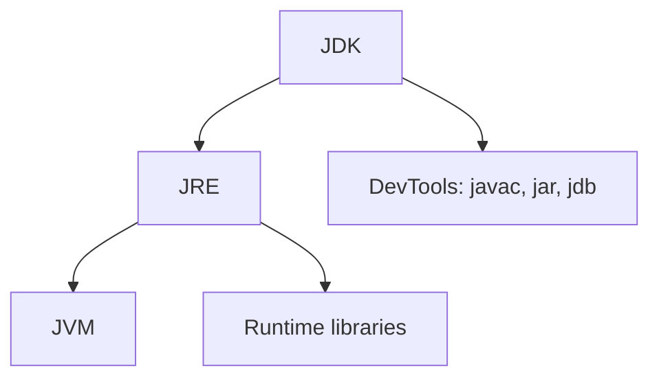

**Interview caveat:** JVM is a specification with multiple implementations (HotSpot, OpenJ9, GraalVM).

<a id="q2"></a>
### Q2: Is JVM platform independent?
**Answer:**
**JVM implementation is platform dependent**, but **Java bytecode is platform independent**.

- You compile once to `.class` bytecode.
- Different OS-specific JVM implementations execute that same bytecode.

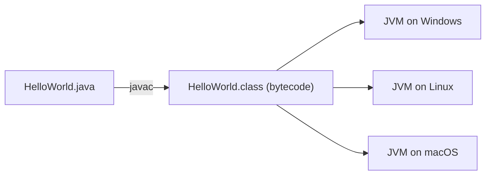

This is the practical meaning of WORA: Write Once, Run Anywhere (with a compatible JVM).

<a id="q3"></a>
### Q3: What are the main components of JVM Architecture?
**Answer:**
Core components:
1. **Class Loader Subsystem**
2. **Runtime Data Areas (Memory)**
3. **Execution Engine** (Interpreter + JIT + GC)
4. **JNI + Native Libraries**

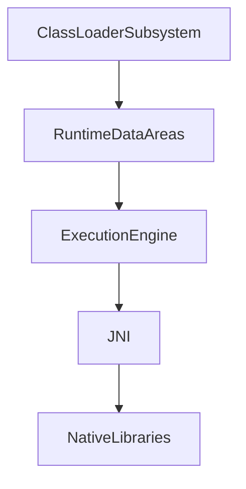

| Component | Role |
|-----------|------|
| ClassLoader | Loads and links classes on demand |
| Runtime Data Areas | Holds class metadata, objects, stacks, etc. |
| Execution Engine | Runs bytecode and optimizes hot code |
| JNI/Native libs | Bridges Java with native code |

<a id="q4"></a>
### Q4: How are JVM instances created and destroyed?
**Answer:**
Creation:
- Running `java MainClass` starts a new OS process with one JVM instance.
- Each Java process gets its own JVM and heap.

Destruction:
1. All non-daemon threads finish, or
2. `System.exit(...)` is called, or
3. Fatal error/forced termination occurs.

```java
Thread daemon = new Thread(() -> runBackground());
daemon.setDaemon(true);
daemon.start(); // JVM does not wait for daemon-only completion
```

**Operational note:** zombie non-daemon threads are a common reason for "app does not shut down."

---

## ClassLoader

<a id="q5"></a>
### Q5: What is ClassLoader and how does it work?
**Answer:**
ClassLoader loads class bytecode into the JVM and defines `Class<?>` objects lazily at runtime.

Responsibilities:
- Locate class bytes by fully qualified name.
- Verify/link class metadata.
- Define class in a specific class loader namespace.

```java
ClassLoader loader = MyClass.class.getClassLoader();
Class<?> c = Class.forName("com.example.MyClass");
```

**Failure modes:**
- `ClassNotFoundException`: class cannot be found by lookup path.
- `NoClassDefFoundError`: class existed at compile time but unavailable at runtime.

<a id="q6"></a>
### Q6: What are the types of ClassLoaders in JVM?
**Answer:**
Modern JVM hierarchy:

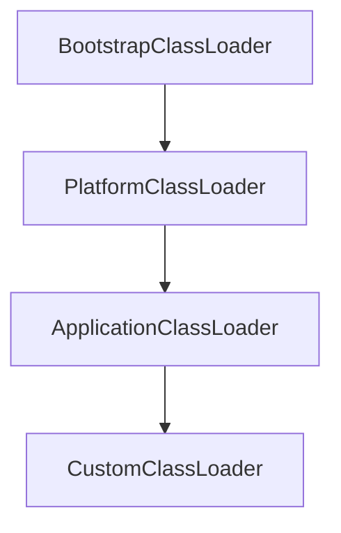

| Loader | Typical content |
|--------|------------------|
| Bootstrap | Core Java classes (`java.lang.*`, etc.) |
| Platform | Platform modules/libraries |
| Application | App classpath/module path |
| Custom | Plugin/module containers, app servers |

**Namespace detail:** the same class name loaded by two different class loaders is treated as different types.

<a id="q7"></a>
### Q7: What are the ClassLoader principles (Delegation, Visibility, Uniqueness)?
**Answer:**
| Principle | Meaning |
|-----------|---------|
| Delegation | Child asks parent first before loading itself |
| Visibility | Child can see parent-loaded classes, not vice versa |
| Uniqueness | A class is uniquely identified by `(className, classLoader)` |

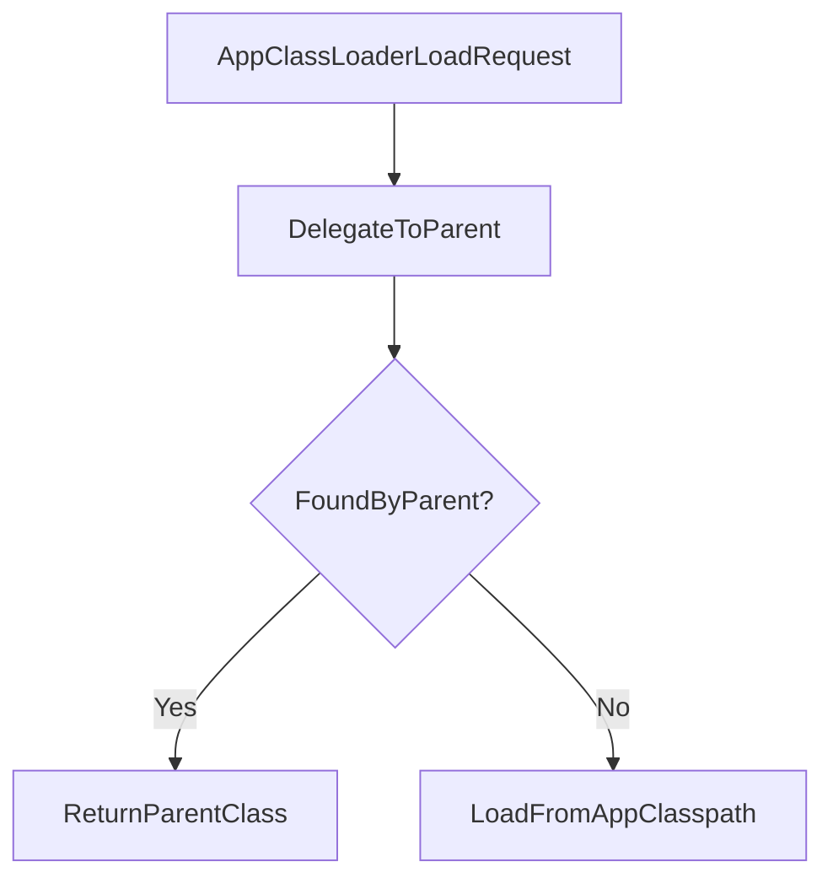

**Security benefit:** delegation prevents app code from spoofing trusted core Java classes.

<a id="q8"></a>
### Q8: What are the phases of class loading (Loading, Linking, Initialization)?
**Answer:**
Three major phases:
1. **Loading**: read class bytes and create `Class` object.
2. **Linking**:
   - Verify bytecode
   - Prepare static memory/defaults
   - Resolve symbolic references (may be lazy)
3. **Initialization**: run static initializers and assign static fields.

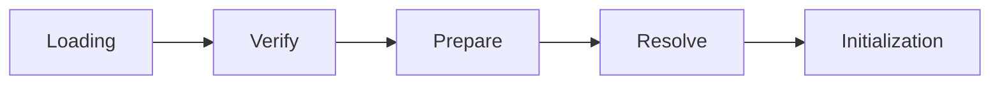

**Interview pitfall:** static init order across classes can cause subtle startup failures.

---

## JVM Memory Areas

<a id="q9"></a>
### Q9: What are the JVM Memory Areas (Runtime Data Areas)?
**Answer:**
Runtime data areas are split into shared (per JVM) and per-thread regions.

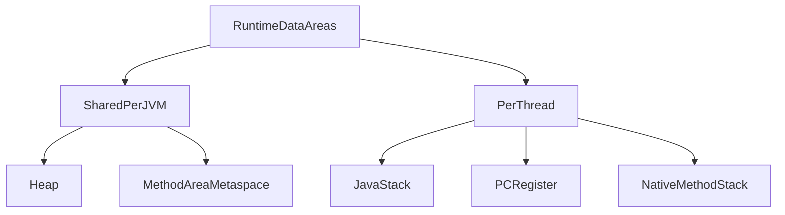

| Area | Shared? | Stores |
|------|---------|--------|
| Heap | Yes | Objects and arrays |
| Method Area/Metaspace | Yes | Class metadata, runtime constants, static info |
| Java Stack | No (per thread) | Frames, local vars, operand stack |
| PC Register | No | Current instruction pointer |
| Native Method Stack | No | Native method call state |

<a id="q10"></a>
### Q10: What is the Method Area?
**Answer:**
Method Area stores class-level metadata:
- class structure and method metadata
- runtime constant pool
- static fields

In HotSpot (Java 8+), class metadata is in **Metaspace** (native memory), replacing PermGen.

**Why it matters:**
- Excessive dynamic class generation can trigger `OutOfMemoryError: Metaspace`.
- Classloader leaks (e.g., app server redeploy issues) are a common metaspace leak root.

<a id="q11"></a>
### Q11: What is the Heap Area?
**Answer:**
Heap is the primary GC-managed memory for objects/arrays.

Typical generational layout:
- Young generation (Eden + Survivor spaces)
- Old generation (tenured objects)

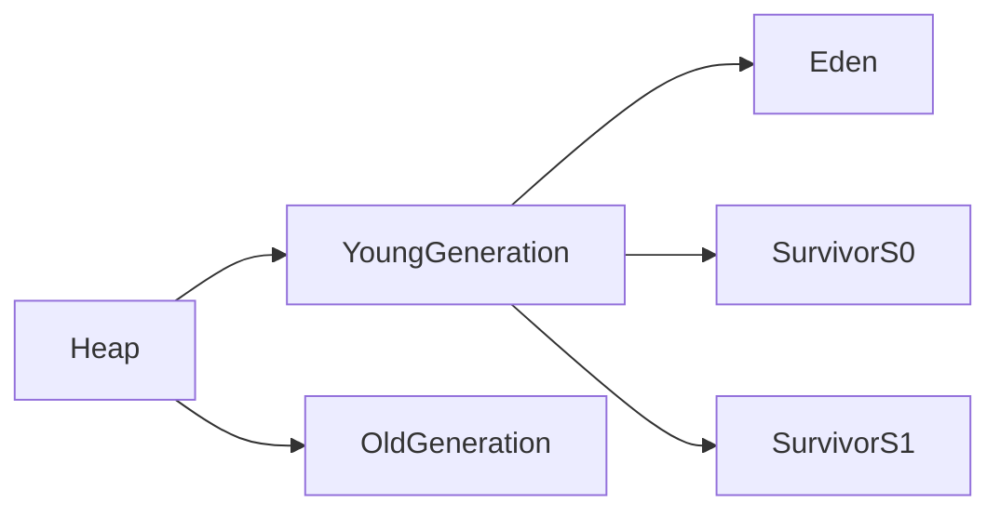

Objects usually start in Eden; long-lived survivors are promoted to Old generation.

<a id="q12"></a>
### Q12: What is the Stack Area?
**Answer:**
Each thread has a private Java stack composed of frames (one frame per active method call).

Frame contains:
- local variable table
- operand stack
- method return/link info

```java
void a() { b(); }
void b() { c(); }
void c() { /* top frame */ }
```

Deep/infinite recursion can exhaust stack memory and throw `StackOverflowError`.

<a id="q13"></a>
### Q13: What are PC Registers and Native Method Stack?
**Answer:**
- **PC Register (per thread):** points to current bytecode instruction being executed.
- **Native Method Stack (per thread):** supports execution state for JNI/native method calls.

When Java thread enters native code, execution context shifts to native stack management.

**Debugging insight:** native crashes often appear outside normal Java stack traces.

<a id="q14"></a>
### Q14: What is the Java Memory Model (JMM)?
**Answer:**
JMM defines how threads interact through memory: visibility, ordering, and happens-before guarantees.

Key guarantees:
- `volatile` write happens-before subsequent `volatile` read of same variable.
- Lock release happens-before subsequent lock acquire on same monitor.
- Thread start/join establish ordering edges.

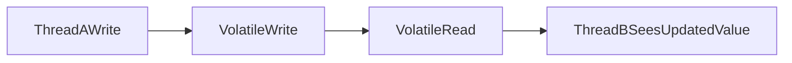

**Critical distinction:** visibility/order is not full atomicity for compound operations (`count++` still unsafe without lock/atomic class).

---

## Execution Engine

<a id="q15"></a>
### Q15: What is the Execution Engine and its components?
**Answer:**
Execution Engine runs bytecode and improves performance over time.

Main parts:
- **Interpreter**: executes bytecode instruction-by-instruction.
- **JIT compiler**: compiles hot code to native machine code.
- **Garbage Collector**: reclaims unreachable memory.

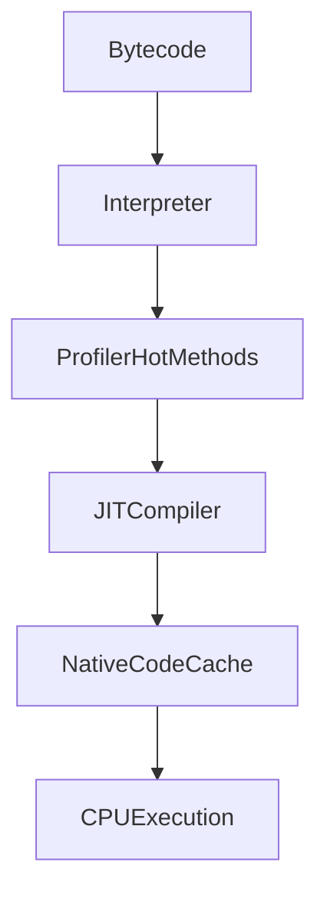

<a id="q16"></a>
### Q16: What is the difference between Interpreter and JIT Compiler?
**Answer:**
| Interpreter | JIT Compiler |
|-------------|--------------|
| Starts quickly | Needs warm-up/profiling |
| Executes bytecode line-by-line | Produces optimized native code |
| Lower peak performance | Higher peak throughput |
| No compile overhead | Compile overhead + code cache usage |

Typical lifecycle: interpreter first, JIT later for hot methods.

<a id="q17"></a>
### Q17: How does JIT Compiler optimize code?
**Answer:**
JIT uses runtime profiling data to apply aggressive optimizations on hot paths:
- method inlining
- loop unrolling
- dead code elimination
- escape analysis and scalar replacement
- lock coarsening/elimination where safe

```java
for (int i = 0; i < n; i++) {
    sum += arr[i];
}
```

On hot loops like above, JIT can heavily optimize machine code compared with interpreter execution.

**Trade-off:** more aggressive optimization can increase warm-up time and code cache usage.

---

## Garbage Collection

<a id="q18"></a>
### Q18: How does Garbage Collection work in Java?
**Answer:**
GC automatically reclaims memory for objects that are no longer reachable from GC roots.

High-level cycle:
1. Identify reachable vs unreachable objects.
2. Reclaim unreachable memory.
3. Optionally compact/relocate live objects (collector-dependent).

Java uses **generational GC** because most objects die young.

<a id="q19"></a>
### Q19: What are the different types of Garbage Collectors?
**Answer:**
Common HotSpot collectors:

| Collector | Goal | Typical fit |
|-----------|------|-------------|
| Serial GC | Simplicity, single-threaded GC | small heaps, simple apps |
| Parallel GC | Throughput | batch jobs, CPU-heavy throughput workloads |
| G1 GC | Balanced latency/throughput | general server default |
| ZGC | Very low pause time | large heaps, latency-sensitive services |
| Shenandoah | Low pause with concurrent compaction | latency-focused workloads |

**Practical guidance:** start with G1 defaults, move to ZGC/Shenandoah only when latency profile requires it.

<a id="q20"></a>
### Q20: What makes an object eligible for garbage collection?
**Answer:**
An object is eligible when it is **unreachable from any GC root**.

Typical ways objects become unreachable:
- reference set to `null`
- reference variable goes out of scope
- owning object becomes unreachable
- classloader unloading drops static references

Circular references are still collectible if the cycle is not reachable from roots.

<a id="q21"></a>
### Q21: What is the difference between Minor GC and Major GC?
**Answer:**
| Minor GC | Major/Old GC |
|----------|--------------|
| Targets young generation | Targets old generation |
| More frequent | Less frequent |
| Usually shorter pauses | Usually longer pauses |
| Reclaims short-lived objects | Reclaims long-lived objects |

Some tools also use **Full GC** to mean whole-heap collection (young + old + metadata depending on collector/JVM).

<a id="q22"></a>
### Q22: What are GC Roots?
**Answer:**
GC roots are starting points for reachability traversal.

Common roots:
- local variables on thread stacks
- static fields
- active thread objects
- JNI references
- monitor/VM internal references

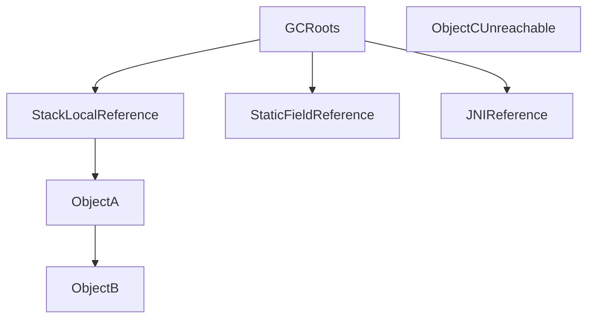

`ObjectCUnreachable` is collectible because no root path reaches it.

<a id="q23"></a>
### Q23: What is Stop-the-World (STW) pause?
**Answer:**
STW is a period where application threads are paused so JVM can perform a critical GC phase safely.

Even low-latency collectors may still have short STW checkpoints.

Impact:
- increased tail latency (p95/p99)
- request timeouts in latency-sensitive services

Mitigation:
- choose suitable collector
- tune heap/GC targets
- reduce allocation pressure
- profile pauses with GC logs/JFR

<a id="q24"></a>
### Q24: What are Weak, Soft, and Phantom References?
**Answer:**
| Reference Type | Collection behavior | Typical use |
|----------------|---------------------|-------------|
| WeakReference | Cleared eagerly on next GC if only weakly reachable | canonical maps, weak-key caches |
| SoftReference | Cleared under memory pressure | memory-sensitive caches (not strict cache policy) |
| PhantomReference | Enqueued after object becomes phantom reachable | post-mortem cleanup tracking |

```java
ReferenceQueue<MyObj> queue = new ReferenceQueue<>();
PhantomReference<MyObj> ref = new PhantomReference<>(obj, queue);
obj = null; // later GC may enqueue ref
```

**Important:** do not use these references as primary lifecycle control; explicit resource management is safer.

<a id="q25"></a>
### Q25: How do you tune and monitor Garbage Collection?
**Answer:**
Start with measurement, not guesswork.

Useful runtime flags:
```bash
java -Xms2g -Xmx2g -XX:+UseG1GC -Xlog:gc*:file=gc.log:time,level,tags -jar app.jar
```

Useful tools:
- `jstat -gc <pid> 1s`
- `jcmd <pid> GC.heap_info`
- Java Flight Recorder (JFR)
- GC log analyzers

Key metrics to monitor:
- allocation rate
- pause times (p95/p99)
- promotion rate
- old generation occupancy
- full GC frequency

**Tuning order:** right-size heap, fix allocation hotspots, then tweak collector-specific knobs.

---

## Security

<a id="q26"></a>
### Q26: What is the difference between Truststore and Keystore?
**Answer:**
| Keystore | Truststore |
|----------|------------|
| Stores your private key + certificate chain (identity) | Stores trusted CA/server certificates (trust anchors) |
| Used to prove who you are | Used to verify peer identity |
| Typically needed on server side | Typically needed on client side (and server for mTLS) |

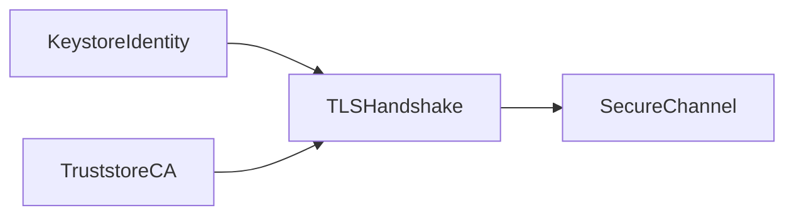

In mutual TLS, both sides can use both stores.

<a id="q27"></a>
### Q27: How do you create and manage Truststore and Keystore?
**Answer:**
Common `keytool` operations:

```bash
# Create keystore with keypair
keytool -genkeypair -alias app -keyalg RSA -keysize 2048 \
  -keystore keystore.p12 -storetype PKCS12

# List entries
keytool -list -v -keystore keystore.p12

# Import certificate into truststore
keytool -importcert -alias server-cert -file server.crt \
  -keystore truststore.p12 -storetype PKCS12
```

Runtime configuration example:
```bash
-Djavax.net.ssl.keyStore=keystore.p12
-Djavax.net.ssl.keyStorePassword=changeit
-Djavax.net.ssl.trustStore=truststore.p12
-Djavax.net.ssl.trustStorePassword=changeit
```

Management best practices:
- prefer PKCS12 over legacy JKS in modern setups
- rotate keys/certs before expiry
- keep private keys encrypted and access-controlled
- never commit store passwords in source control

---

[← Back to Java Index](README.md)
