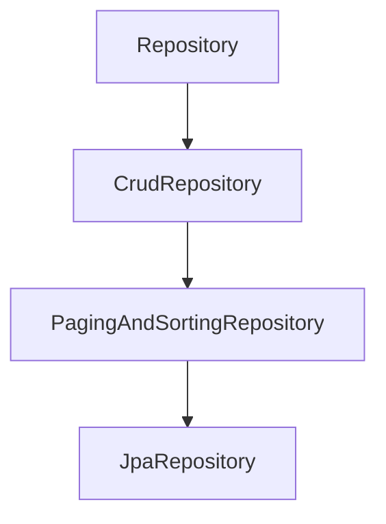

# Spring Data (JPA, JDBC, Hibernate)

## Table of Contents

### Spring Data JPA
- [Q1: What is Spring Data JPA?](#q1)
- [Q2: What is the difference between JpaRepository, CrudRepository, and PagingAndSortingRepository?](#q2)

### Spring JDBC
- [Q3: What is Spring JDBC and when would you use it over JPA?](#q3)
- [Q4: How do you use JdbcTemplate?](#q4)
- [Q5: What is the difference between JdbcTemplate and NamedParameterJdbcTemplate?](#q5)

### Hibernate & ORM
- [Q6: What is ORM and how does Hibernate implement it?](#q6)
- [Q7: What is the N+1 problem and how do you solve it?](#q7)

### Advanced Data Layer Topics
- [Q8: How do transaction propagation and isolation levels work in the data layer?](#q8)
- [Q9: What is the difference between optimistic and pessimistic locking, and when should you use each?](#q9)
- [Q10: When should you use lazy vs eager fetch, and how do you avoid fetch-related performance issues?](#q10)
- [Q11: How do you implement batch inserts and updates efficiently with JPA?](#q11)
- [Q12: What are common pagination pitfalls with JPA and how do you avoid them?](#q12)
- [Q13: How does Hibernate dirty checking work, and when can it hurt performance?](#q13)
- [Q14: How do you use @Modifying for bulk updates, and what are the caveats?](#q14)
- [Q15: How do projections and query hints optimize read-heavy endpoints?](#q15)

---

## Spring Data JPA

<a id="q1"></a>
### Q1: What is Spring Data JPA?
**Answer:**
Spring Data JPA is a repository abstraction on top of JPA providers (commonly Hibernate) that reduces repetitive DAO boilerplate.

Core capabilities:
- Repository interfaces with prebuilt CRUD operations
- Query derivation from method names
- Pagination/sorting support (`Pageable`, `Sort`)
- Custom JPQL/native queries (`@Query`)
- Projection support (interface/class-based)

```java
public interface UserRepository extends JpaRepository<User, Long> {
    List<User> findByStatusAndEmailContaining(Status status, String emailPart);

    @Query("select u from User u where u.createdAt >= :from")
    List<User> findRecent(@Param("from") LocalDateTime from);
}
```

**Trade-off:** repository abstraction accelerates delivery, but complex read models may still need tuned SQL/JOOQ/JdbcTemplate paths.

<a id="q2"></a>
### Q2: What is the difference between JpaRepository, CrudRepository, and PagingAndSortingRepository?
**Answer:**


| Interface | Adds |
|-----------|------|
| `CrudRepository` | basic CRUD (`save`, `findById`, `delete`) |
| `PagingAndSortingRepository` | paging/sorting (`findAll(Pageable)`) |
| `JpaRepository` | JPA-specific methods (`flush`, batch delete helpers) |

Use `JpaRepository` by default in most Spring Boot JPA applications unless you intentionally want a narrower contract.

---

## Spring JDBC

<a id="q3"></a>
### Q3: What is Spring JDBC and when would you use it over JPA?
**Answer:**
Spring JDBC is a lightweight abstraction over plain JDBC that removes connection/statement/result-set boilerplate.

| Prefer Spring JDBC | Prefer JPA |
|--------------------|------------|
| SQL-first data access | Domain-object-centric CRUD |
| Complex joins/reporting SQL | rich entity graph management |
| Bulk writes / batch ETL | rapid dev with repository patterns |
| Need exact query/perf control | benefit from dirty checking & mapping |

Use JDBC when query shape is complex and explicit SQL is a better fit than ORM mapping overhead.

<a id="q4"></a>
### Q4: How do you use JdbcTemplate?
**Answer:**
`JdbcTemplate` centralizes resource handling and exception translation into Spring `DataAccessException`.

```java
@Repository
public class UserJdbcRepository {
    private final JdbcTemplate jdbcTemplate;

    public UserJdbcRepository(JdbcTemplate jdbcTemplate) {
        this.jdbcTemplate = jdbcTemplate;
    }

    public List<User> findAll() {
        String sql = "select id, name, email from users";
        return jdbcTemplate.query(sql, (rs, rowNum) ->
            new User(rs.getLong("id"), rs.getString("name"), rs.getString("email")));
    }

    public int rename(long id, String name) {
        return jdbcTemplate.update("update users set name = ? where id = ?", name, id);
    }

    public int[] batchInsert(List<User> users) {
        String sql = "insert into users(name, email) values (?, ?)";
        return jdbcTemplate.batchUpdate(sql, users, 200,
            (ps, u) -> {
                ps.setString(1, u.getName());
                ps.setString(2, u.getEmail());
            });
    }
}
```

**Interview point:** use explicit transactions for multi-step consistency; `JdbcTemplate` itself is not a transaction manager.

<a id="q5"></a>
### Q5: What is the difference between JdbcTemplate and NamedParameterJdbcTemplate?
**Answer:**
| JdbcTemplate | NamedParameterJdbcTemplate |
|--------------|----------------------------|
| Positional placeholders (`?`) | Named placeholders (`:name`) |
| Parameter order sensitive | Parameter order independent |
| Can get hard to read with many params | More readable and safer for dynamic conditions |

```java
String sql = """
    select * from users
    where status = :status
      and created_at >= :from
""";
MapSqlParameterSource params = new MapSqlParameterSource()
    .addValue("status", "ACTIVE")
    .addValue("from", Timestamp.from(Instant.now().minus(30, ChronoUnit.DAYS)));

List<User> users = namedParameterJdbcTemplate.query(sql, params, rowMapper);
```

Use named parameters for maintainability once query complexity grows.

---

## Hibernate & ORM

<a id="q6"></a>
### Q6: What is ORM and how does Hibernate implement it?
**Answer:**
ORM maps object models to relational tables so developers work with entities instead of manually mapping every row.

Hibernate (as a JPA provider) adds:
- entity lifecycle management
- persistence context (first-level cache)
- dirty checking (automatic update generation)
- fetch strategies and lazy loading
- JPQL/HQL query support

| Java | Database |
|------|----------|
| Entity class | Table |
| Field | Column |
| Association | Foreign key relationship |
| Entity instance | Row |

**Trade-off:** ORM improves productivity but can hide SQL complexity; teams still need SQL literacy for production tuning.

<a id="q7"></a>
### Q7: What is the N+1 problem and how do you solve it?
**Answer:**
N+1 occurs when one query loads parent rows, then an additional query is executed for each parent to fetch a relation.

```java
List<Author> authors = authorRepository.findAll(); // 1 query
for (Author author : authors) {
    author.getBooks().size(); // +N queries if lazy-loaded per row
}
```

Mitigation options:
1. `JOIN FETCH` for targeted eager graph loads
2. `@EntityGraph` on repository methods
3. Batch fetching (`@BatchSize` or provider settings)
4. DTO projections for read-heavy endpoints

```java
@Query("select a from Author a join fetch a.books")
List<Author> findAllWithBooks();

@EntityGraph(attributePaths = "books")
List<Author> findAll();
```

**Important caveat:** fetch joins with pagination can produce duplicates or inefficient SQL depending on provider and query shape.

---

## Advanced Data Layer Topics

<a id="q8"></a>
### Q8: How do transaction propagation and isolation levels work in the data layer?
**Answer:**
In Spring Data applications, `@Transactional` defines both boundary behavior (propagation) and concurrency guarantees (isolation).

Propagation (how a called method joins/creates a transaction):
- `REQUIRED`: join existing or create new (default).
- `REQUIRES_NEW`: suspend current and create independent transaction.
- `SUPPORTS`: join if exists, otherwise run non-transactional.
- `MANDATORY`: fail if no existing transaction.

Isolation (read consistency level, DB-dependent):
- `READ_COMMITTED`: prevents dirty reads (common default).
- `REPEATABLE_READ`: prevents non-repeatable reads.
- `SERIALIZABLE`: strongest consistency, highest contention risk.

```java
@Service
class PaymentService {
    @Transactional(propagation = Propagation.REQUIRED, isolation = Isolation.READ_COMMITTED)
    public void pay(Order order) {
        reserveBalance(order);
        markPaid(order);
    }

    @Transactional(propagation = Propagation.REQUIRES_NEW)
    public void writeAuditLog(AuditEvent event) {
        auditRepository.save(event);
    }
}
```

**Practical tip:** Use stricter isolation only for specific hot paths; globally high isolation can reduce throughput.

<a id="q9"></a>
### Q9: What is the difference between optimistic and pessimistic locking, and when should you use each?
**Answer:**
| Optimistic Locking | Pessimistic Locking |
|--------------------|---------------------|
| Detects conflicts at commit/update time | Prevents conflicts by locking rows early |
| Uses version column (`@Version`) | Uses DB locks (`SELECT ... FOR UPDATE`) |
| Better for read-heavy, low-conflict workloads | Better for high-conflict critical updates |
| May fail and require retry | Can block and increase contention/deadlock risk |

```java
@Entity
class Product {
    @Id Long id;
    @Version Long version;
    int stock;
}
```

```java
@Lock(LockModeType.PESSIMISTIC_WRITE)
@Query("select p from Product p where p.id = :id")
Optional<Product> findForUpdate(@Param("id") Long id);
```

**Rule of thumb:** start optimistic; switch to targeted pessimistic locks where collision/retry cost is too high.

<a id="q10"></a>
### Q10: When should you use lazy vs eager fetch, and how do you avoid fetch-related performance issues?
**Answer:**
- `LAZY`: load relation only when accessed (usually better default for collections).
- `EAGER`: load relation immediately (can cause over-fetch and large joins).

```java
@OneToMany(mappedBy = "author", fetch = FetchType.LAZY)
private List<Book> books;
```

Avoid common fetch issues by:
1. keeping association defaults conservative (`LAZY` for to-many),
2. using query-time fetch plans (`JOIN FETCH`, `@EntityGraph`) per use case,
3. avoiding serialization of uninitialized lazy proxies outside transaction,
4. using DTO projections for API read models.

**Pitfall:** blanket EAGER mappings can silently degrade endpoint latency.

<a id="q11"></a>
### Q11: How do you implement batch inserts and updates efficiently with JPA?
**Answer:**
Enable batching in provider config and control persistence context size.

```properties
spring.jpa.properties.hibernate.jdbc.batch_size=50
spring.jpa.properties.hibernate.order_inserts=true
spring.jpa.properties.hibernate.order_updates=true
```

```java
@Transactional
public void saveAllInBatches(List<User> users) {
    int batchSize = 50;
    for (int i = 0; i < users.size(); i++) {
        entityManager.persist(users.get(i));
        if (i > 0 && i % batchSize == 0) {
            entityManager.flush();
            entityManager.clear();
        }
    }
}
```

**Why flush/clear:** prevents huge first-level cache growth and memory pressure during large batch jobs.

<a id="q12"></a>
### Q12: What are common pagination pitfalls with JPA and how do you avoid them?
**Answer:**
Common pitfalls:
1. `fetch join` with `Pageable` can produce duplicates/cartesian explosion.
2. Auto-generated count query may be expensive or incorrect with complex joins.
3. Deep offset pagination degrades on large tables.

Mitigations:
- Page root IDs first, then fetch details in a second query.
- Provide explicit `countQuery` when using custom JPQL.
- Use keyset/cursor pagination for high-scale sorted feeds.

```java
@Query(
  value = "select u from User u where u.status = :status",
  countQuery = "select count(u) from User u where u.status = :status"
)
Page<User> findPageByStatus(@Param("status") Status status, Pageable pageable);
```

<a id="q13"></a>
### Q13: How does Hibernate dirty checking work, and when can it hurt performance?
**Answer:**
Hibernate tracks managed entities in the persistence context and compares state snapshots at flush time.

When it hurts:
- very large persistence contexts,
- long transactions touching many entities,
- unnecessary flush frequency,
- loading entities for updates when bulk DML would be better.

```java
@Transactional(readOnly = true)
public List<UserDto> listUsers() { ... } // hint for read-only path
```

**Optimization pattern:** keep transactions short, load only needed entities, use DTO projections for read-only flows.

<a id="q14"></a>
### Q14: How do you use @Modifying for bulk updates, and what are the caveats?
**Answer:**
`@Modifying` executes bulk update/delete JPQL directly in DB without loading entities.

```java
@Modifying(clearAutomatically = true, flushAutomatically = true)
@Query("update User u set u.status = :status where u.lastLogin < :cutoff")
int markInactive(@Param("status") Status status, @Param("cutoff") LocalDateTime cutoff);
```

Caveats:
- bypasses entity lifecycle callbacks.
- bypasses first-level cache state for affected entities.
- can leave stale managed entities unless context is cleared.
- should run inside explicit transaction.

<a id="q15"></a>
### Q15: How do projections and query hints optimize read-heavy endpoints?
**Answer:**
Projections fetch only required columns and avoid full entity hydration cost.

```java
public interface UserSummary {
    Long getId();
    String getEmail();
}

@Query("select u.id as id, u.email as email from User u where u.status = :status")
List<UserSummary> findSummaries(@Param("status") Status status);
```

Query hints can tune fetch/read behavior (provider-specific), for example read-only and timeout hints.

```java
@QueryHints({
    @QueryHint(name = org.hibernate.annotations.QueryHints.READ_ONLY, value = "true"),
    @QueryHint(name = "jakarta.persistence.query.timeout", value = "2000")
})
@Query("select u from User u where u.status = :status")
List<User> findFastReadOnly(@Param("status") Status status);
```

**Best use case:** API listing/search endpoints where partial views dominate and write tracking is unnecessary.

---

[← Back to Java Index](README.md)
