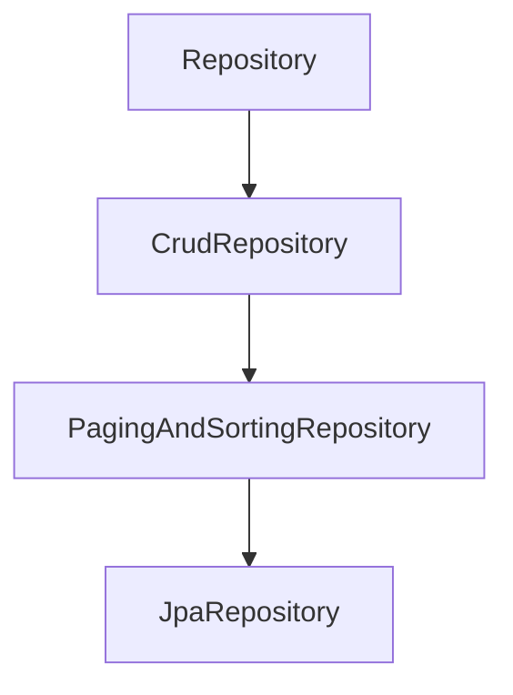
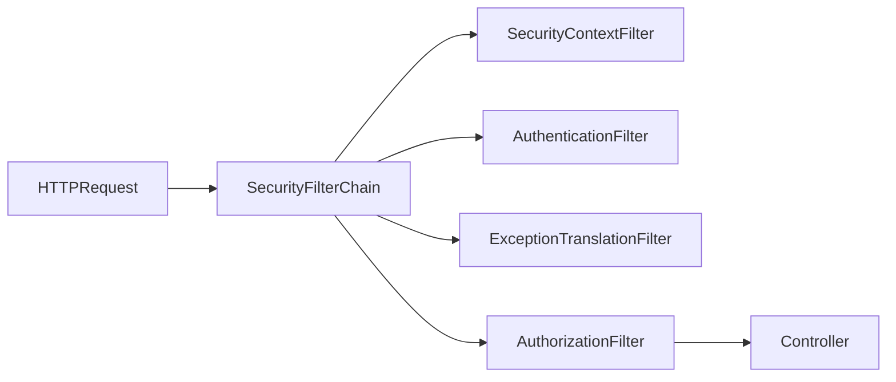

# Spring Web & Data (JPA, JDBC, WebFlux, Security)

## Table of Contents

### Spring Data JPA
- [Q1: What is Spring Data JPA?](#q1)
- [Q2: What is the difference between JpaRepository, CrudRepository, and PagingAndSortingRepository?](#q2)

### Spring JDBC
- [Q3: What is Spring JDBC and when would you use it over JPA?](#q3)
- [Q4: How do you use JdbcTemplate?](#q4)
- [Q5: What is the difference between JdbcTemplate and NamedParameterJdbcTemplate?](#q5)

### Hibernate & ORM
- [Q6: What is ORM and how does Hibernate implement it?](#q6)
- [Q7: What is the N+1 problem and how do you solve it?](#q7)

### Reactive Programming (WebFlux)
- [Q8: What is reactive programming and Spring WebFlux?](#q8)
- [Q9: What is the difference between Mono and Flux?](#q9)
- [Q10: How do you handle backpressure in reactive streams?](#q10)
- [Q11: When should you use WebFlux vs Spring MVC?](#q11)

### Spring Security
- [Q12: What is Spring Security and how does it work?](#q12)
- [Q13: What is the difference between authentication and authorization?](#q13)
- [Q14: How do you implement JWT authentication in Spring Boot?](#q14)
- [Q15: What are the common Spring Security annotations?](#q15)
- [Q16: How do you configure CORS in Spring Security?](#q16)

---

## Spring Data JPA

<a id="q1"></a>
### Q1: What is Spring Data JPA?
**Answer:**
Spring Data JPA is a repository abstraction on top of JPA providers (commonly Hibernate) that reduces repetitive DAO boilerplate.

Core capabilities:
- Repository interfaces with prebuilt CRUD operations
- Query derivation from method names
- Pagination/sorting support (`Pageable`, `Sort`)
- Custom JPQL/native queries (`@Query`)
- Projection support (interface/class-based)

```java
public interface UserRepository extends JpaRepository<User, Long> {
    List<User> findByStatusAndEmailContaining(Status status, String emailPart);

    @Query("select u from User u where u.createdAt >= :from")
    List<User> findRecent(@Param("from") LocalDateTime from);
}
```

**Trade-off:** repository abstraction accelerates delivery, but complex read models may still need tuned SQL/JOOQ/JdbcTemplate paths.

<a id="q2"></a>
### Q2: What is the difference between JpaRepository, CrudRepository, and PagingAndSortingRepository?
**Answer:**


| Interface | Adds |
|-----------|------|
| `CrudRepository` | basic CRUD (`save`, `findById`, `delete`) |
| `PagingAndSortingRepository` | paging/sorting (`findAll(Pageable)`) |
| `JpaRepository` | JPA-specific methods (`flush`, batch delete helpers) |

Use `JpaRepository` by default in most Spring Boot JPA applications unless you intentionally want a narrower contract.

---

## Spring JDBC

<a id="q3"></a>
### Q3: What is Spring JDBC and when would you use it over JPA?
**Answer:**
Spring JDBC is a lightweight abstraction over plain JDBC that removes connection/statement/result-set boilerplate.

| Prefer Spring JDBC | Prefer JPA |
|--------------------|------------|
| SQL-first data access | Domain-object-centric CRUD |
| Complex joins/reporting SQL | rich entity graph management |
| Bulk writes / batch ETL | rapid dev with repository patterns |
| Need exact query/perf control | benefit from dirty checking & mapping |

Use JDBC when query shape is complex and explicit SQL is a better fit than ORM mapping overhead.

<a id="q4"></a>
### Q4: How do you use JdbcTemplate?
**Answer:**
`JdbcTemplate` centralizes resource handling and exception translation into Spring `DataAccessException`.

```java
@Repository
public class UserJdbcRepository {
    private final JdbcTemplate jdbcTemplate;

    public UserJdbcRepository(JdbcTemplate jdbcTemplate) {
        this.jdbcTemplate = jdbcTemplate;
    }

    public List<User> findAll() {
        String sql = "select id, name, email from users";
        return jdbcTemplate.query(sql, (rs, rowNum) ->
            new User(rs.getLong("id"), rs.getString("name"), rs.getString("email")));
    }

    public int rename(long id, String name) {
        return jdbcTemplate.update("update users set name = ? where id = ?", name, id);
    }

    public int[] batchInsert(List<User> users) {
        String sql = "insert into users(name, email) values (?, ?)";
        return jdbcTemplate.batchUpdate(sql, users, 200,
            (ps, u) -> {
                ps.setString(1, u.getName());
                ps.setString(2, u.getEmail());
            });
    }
}
```

**Interview point:** use explicit transactions for multi-step consistency; `JdbcTemplate` itself is not a transaction manager.

<a id="q5"></a>
### Q5: What is the difference between JdbcTemplate and NamedParameterJdbcTemplate?
**Answer:**
| JdbcTemplate | NamedParameterJdbcTemplate |
|--------------|----------------------------|
| Positional placeholders (`?`) | Named placeholders (`:name`) |
| Parameter order sensitive | Parameter order independent |
| Can get hard to read with many params | More readable and safer for dynamic conditions |

```java
String sql = """
    select * from users
    where status = :status
      and created_at >= :from
""";
MapSqlParameterSource params = new MapSqlParameterSource()
    .addValue("status", "ACTIVE")
    .addValue("from", Timestamp.from(Instant.now().minus(30, ChronoUnit.DAYS)));

List<User> users = namedParameterJdbcTemplate.query(sql, params, rowMapper);
```

Use named parameters for maintainability once query complexity grows.

---

## Hibernate & ORM

<a id="q6"></a>
### Q6: What is ORM and how does Hibernate implement it?
**Answer:**
ORM maps object models to relational tables so developers work with entities instead of manually mapping every row.

Hibernate (as a JPA provider) adds:
- entity lifecycle management
- persistence context (first-level cache)
- dirty checking (automatic update generation)
- fetch strategies and lazy loading
- JPQL/HQL query support

| Java | Database |
|------|----------|
| Entity class | Table |
| Field | Column |
| Association | Foreign key relationship |
| Entity instance | Row |

**Trade-off:** ORM improves productivity but can hide SQL complexity; teams still need SQL literacy for production tuning.

<a id="q7"></a>
### Q7: What is the N+1 problem and how do you solve it?
**Answer:**
N+1 occurs when one query loads parent rows, then an additional query is executed for each parent to fetch a relation.

```java
List<Author> authors = authorRepository.findAll(); // 1 query
for (Author author : authors) {
    author.getBooks().size(); // +N queries if lazy-loaded per row
}
```

Mitigation options:
1. `JOIN FETCH` for targeted eager graph loads
2. `@EntityGraph` on repository methods
3. Batch fetching (`@BatchSize` or provider settings)
4. DTO projections for read-heavy endpoints

```java
@Query("select a from Author a join fetch a.books")
List<Author> findAllWithBooks();

@EntityGraph(attributePaths = "books")
List<Author> findAll();
```

**Important caveat:** fetch joins with pagination can produce duplicates or inefficient SQL depending on provider and query shape.

---

## Reactive Programming (WebFlux)

<a id="q8"></a>
### Q8: What is reactive programming and Spring WebFlux?
**Answer:**
Reactive programming models asynchronous streams with non-blocking execution and backpressure control.

WebFlux is Spring’s reactive web stack built on Reactor (`Mono`, `Flux`) and non-blocking runtimes (for example, Netty).

```java
@RestController
@RequestMapping("/api/users")
class UserController {
    private final UserService userService;

    UserController(UserService userService) { this.userService = userService; }

    @GetMapping("/{id}")
    Mono<User> getById(@PathVariable String id) {
        return userService.findById(id);
    }

    @GetMapping(produces = MediaType.TEXT_EVENT_STREAM_VALUE)
    Flux<User> stream() {
        return userService.streamAll();
    }
}
```

**Rule of thumb:** WebFlux shines for high-concurrency I/O-bound workloads with reactive dependencies.

<a id="q9"></a>
### Q9: What is the difference between Mono and Flux?
**Answer:**
| Mono<T> | Flux<T> |
|---------|---------|
| 0..1 element | 0..N elements |
| Single async result | Async sequence/stream |
| Good for one resource | Good for lists/events/streams |

```java
Mono<User> one = userService.findById("u-1");
Flux<User> many = userService.findAll();

Mono<List<User>> asList = many.collectList();
Flux<User> asFlux = one.flux();
```

Choose based on cardinality semantics, not convenience.

<a id="q10"></a>
### Q10: How do you handle backpressure in reactive streams?
**Answer:**
Backpressure manages producer speed relative to consumer capacity.

| Strategy | Behavior | Typical use |
|----------|----------|-------------|
| `onBackpressureBuffer(n)` | queue up to n items | absorb short bursts |
| `onBackpressureDrop()` | drop excess items | telemetry/event streams |
| `onBackpressureLatest()` | keep latest only | state updates/UI |
| `limitRate(n)` | request data in chunks | controlled downstream pressure |

```java
Flux.interval(Duration.ofMillis(1))
    .onBackpressureDrop(d -> log.warn("Dropped {}", d))
    .publishOn(Schedulers.boundedElastic(), 64)
    .subscribe(this::slowConsumer);
```

**Production advice:** monitor dropped/buffered metrics and decide policy explicitly; silent data loss is dangerous.

<a id="q11"></a>
### Q11: When should you use WebFlux vs Spring MVC?
**Answer:**
| Use WebFlux | Use Spring MVC |
|-------------|----------------|
| high concurrent I/O | classic request-response apps |
| reactive stack end-to-end (R2DBC/WebClient) | blocking stack (JDBC/JPA) |
| stream processing/SSE | straightforward CRUD with simple ops |
| you can enforce non-blocking discipline | team prefers imperative model |

WebFlux drawbacks:
- steeper learning/debugging curve
- accidental blocking can negate benefits
- ecosystem still has blocking libraries in many domains

If your DB and downstream clients are blocking, MVC is often the pragmatic choice.

---

## Spring Security

<a id="q12"></a>
### Q12: What is Spring Security and how does it work?
**Answer:**
Spring Security secures applications via filter chain processing, authentication mechanisms, and authorization checks.



Minimal config:
```java
@Configuration
@EnableWebSecurity
class SecurityConfig {
    @Bean
    SecurityFilterChain filterChain(HttpSecurity http) throws Exception {
        return http
            .csrf(csrf -> csrf.disable())
            .authorizeHttpRequests(auth -> auth
                .requestMatchers("/public/**").permitAll()
                .requestMatchers("/admin/**").hasRole("ADMIN")
                .anyRequest().authenticated())
            .build();
    }
}
```

**Conceptual flow:** authenticate user -> build `Authentication` -> store in `SecurityContext` -> authorize request/method access.

<a id="q13"></a>
### Q13: What is the difference between authentication and authorization?
**Answer:**
| Authentication | Authorization |
|----------------|---------------|
| Verifies identity ("who are you?") | Verifies permissions ("what can you do?") |
| Happens at login/token validation | Happens at endpoint/method/resource check |
| Failure typically 401 | Failure typically 403 |

Authentication should not imply full access; authorization must still be enforced at resource boundaries.

<a id="q14"></a>
### Q14: How do you implement JWT authentication in Spring Boot?
**Answer:**
Typical stateless JWT setup:
1. Client authenticates (username/password, OAuth, etc.).
2. Server issues signed JWT (short TTL) + optional refresh token.
3. Client sends `Authorization: Bearer <token>`.
4. Filter validates token, then sets `SecurityContext`.

```java
@Bean
SecurityFilterChain filterChain(HttpSecurity http) throws Exception {
    return http
        .csrf(csrf -> csrf.disable())
        .sessionManagement(s -> s.sessionCreationPolicy(SessionCreationPolicy.STATELESS))
        .authorizeHttpRequests(auth -> auth
            .requestMatchers("/auth/**").permitAll()
            .anyRequest().authenticated())
        .addFilterBefore(jwtAuthFilter, UsernamePasswordAuthenticationFilter.class)
        .build();
}
```

JWT hardening checklist:
- sign with strong key and rotate keys
- validate `exp`, `iss`, `aud`, and token type
- keep access tokens short-lived
- revoke/blacklist strategy for critical scenarios
- never store sensitive secrets in token payload

<a id="q15"></a>
### Q15: What are the common Spring Security annotations?
**Answer:**
| Annotation | Purpose |
|------------|---------|
| `@EnableWebSecurity` | enables web security config |
| `@EnableMethodSecurity` | enables method-level access control |
| `@PreAuthorize` | checks before method call |
| `@PostAuthorize` | checks after method call |
| `@Secured` | role-based checks (simpler style) |

```java
@EnableMethodSecurity
@Configuration
class SecurityMethodConfig {}

@PreAuthorize("hasRole('ADMIN')")
public void adminOnly() {}

@PreAuthorize("#userId == authentication.principal.id")
public User getUser(Long userId) { ... }
```

Use method security to protect business-level operations, not only HTTP endpoints.

<a id="q16"></a>
### Q16: How do you configure CORS in Spring Security?
**Answer:**
Configure CORS in the security chain so preflight (`OPTIONS`) is evaluated correctly before auth checks.

```java
@Bean
SecurityFilterChain filterChain(HttpSecurity http) throws Exception {
    return http
        .cors(cors -> cors.configurationSource(corsConfigurationSource()))
        .csrf(csrf -> csrf.disable())
        .authorizeHttpRequests(auth -> auth.anyRequest().authenticated())
        .build();
}

@Bean
CorsConfigurationSource corsConfigurationSource() {
    CorsConfiguration config = new CorsConfiguration();
    config.setAllowedOrigins(List.of("https://app.example.com"));
    config.setAllowedMethods(List.of("GET", "POST", "PUT", "DELETE", "OPTIONS"));
    config.setAllowedHeaders(List.of("Authorization", "Content-Type"));
    config.setAllowCredentials(true);
    config.setMaxAge(3600L);

    UrlBasedCorsConfigurationSource source = new UrlBasedCorsConfigurationSource();
    source.registerCorsConfiguration("/**", config);
    return source;
}
```

**Common pitfalls:**
- using `"*"` with `allowCredentials(true)` (invalid combination)
- forgetting preflight support
- allowing overly broad origins/methods in production

---

[← Back to Java Index](README.md)
