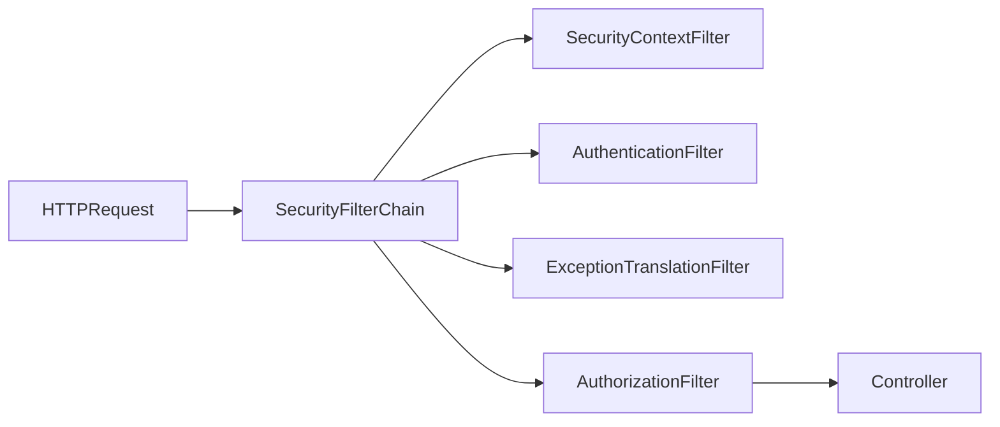

# Spring Web & Security (WebFlux, Security)

## Table of Contents

### Reactive Programming (WebFlux)
- [Q1: What is reactive programming and Spring WebFlux?](#q1)
- [Q2: What is the difference between Mono and Flux?](#q2)
- [Q3: How do you handle backpressure in reactive streams?](#q3)
- [Q4: When should you use WebFlux vs Spring MVC?](#q4)

### Spring Security
- [Q5: What is Spring Security and how does it work?](#q5)
- [Q6: What is the difference between authentication and authorization?](#q6)
- [Q7: How do you implement JWT authentication in Spring Boot?](#q7)
- [Q8: What are the common Spring Security annotations?](#q8)
- [Q9: How do you configure CORS in Spring Security?](#q9)

---

## Reactive Programming (WebFlux)

<a id="q1"></a>
### Q1: What is reactive programming and Spring WebFlux?
**Answer:**
Reactive programming models asynchronous streams with non-blocking execution and backpressure control.

WebFlux is Spring’s reactive web stack built on Reactor (`Mono`, `Flux`) and non-blocking runtimes (for example, Netty).

```java
@RestController
@RequestMapping("/api/users")
class UserController {
    private final UserService userService;

    UserController(UserService userService) { this.userService = userService; }

    @GetMapping("/{id}")
    Mono<User> getById(@PathVariable String id) {
        return userService.findById(id);
    }

    @GetMapping(produces = MediaType.TEXT_EVENT_STREAM_VALUE)
    Flux<User> stream() {
        return userService.streamAll();
    }
}
```

**Rule of thumb:** WebFlux shines for high-concurrency I/O-bound workloads with reactive dependencies.

<a id="q2"></a>
### Q2: What is the difference between Mono and Flux?
**Answer:**
| Mono<T> | Flux<T> |
|---------|---------|
| 0..1 element | 0..N elements |
| Single async result | Async sequence/stream |
| Good for one resource | Good for lists/events/streams |

```java
Mono<User> one = userService.findById("u-1");
Flux<User> many = userService.findAll();

Mono<List<User>> asList = many.collectList();
Flux<User> asFlux = one.flux();
```

Choose based on cardinality semantics, not convenience.

<a id="q3"></a>
### Q3: How do you handle backpressure in reactive streams?
**Answer:**
Backpressure manages producer speed relative to consumer capacity.

| Strategy | Behavior | Typical use |
|----------|----------|-------------|
| `onBackpressureBuffer(n)` | queue up to n items | absorb short bursts |
| `onBackpressureDrop()` | drop excess items | telemetry/event streams |
| `onBackpressureLatest()` | keep latest only | state updates/UI |
| `limitRate(n)` | request data in chunks | controlled downstream pressure |

```java
Flux.interval(Duration.ofMillis(1))
    .onBackpressureDrop(d -> log.warn("Dropped {}", d))
    .publishOn(Schedulers.boundedElastic(), 64)
    .subscribe(this::slowConsumer);
```

**Production advice:** monitor dropped/buffered metrics and decide policy explicitly; silent data loss is dangerous.

<a id="q4"></a>
### Q4: When should you use WebFlux vs Spring MVC?
**Answer:**
| Use WebFlux | Use Spring MVC |
|-------------|----------------|
| high concurrent I/O | classic request-response apps |
| reactive stack end-to-end (R2DBC/WebClient) | blocking stack (JDBC/JPA) |
| stream processing/SSE | straightforward CRUD with simple ops |
| you can enforce non-blocking discipline | team prefers imperative model |

WebFlux drawbacks:
- steeper learning/debugging curve
- accidental blocking can negate benefits
- ecosystem still has blocking libraries in many domains

If your DB and downstream clients are blocking, MVC is often the pragmatic choice.

---

## Spring Security

<a id="q5"></a>
### Q5: What is Spring Security and how does it work?
**Answer:**
Spring Security secures applications via filter chain processing, authentication mechanisms, and authorization checks.



Minimal config:
```java
@Configuration
@EnableWebSecurity
class SecurityConfig {
    @Bean
    SecurityFilterChain filterChain(HttpSecurity http) throws Exception {
        return http
            .csrf(csrf -> csrf.disable())
            .authorizeHttpRequests(auth -> auth
                .requestMatchers("/public/**").permitAll()
                .requestMatchers("/admin/**").hasRole("ADMIN")
                .anyRequest().authenticated())
            .build();
    }
}
```

**Conceptual flow:** authenticate user -> build `Authentication` -> store in `SecurityContext` -> authorize request/method access.

<a id="q6"></a>
### Q6: What is the difference between authentication and authorization?
**Answer:**
| Authentication | Authorization |
|----------------|---------------|
| Verifies identity ("who are you?") | Verifies permissions ("what can you do?") |
| Happens at login/token validation | Happens at endpoint/method/resource check |
| Failure typically 401 | Failure typically 403 |

Authentication should not imply full access; authorization must still be enforced at resource boundaries.

<a id="q7"></a>
### Q7: How do you implement JWT authentication in Spring Boot?
**Answer:**
Typical stateless JWT setup:
1. Client authenticates (username/password, OAuth, etc.).
2. Server issues signed JWT (short TTL) + optional refresh token.
3. Client sends `Authorization: Bearer <token>`.
4. Filter validates token, then sets `SecurityContext`.

```java
@Bean
SecurityFilterChain filterChain(HttpSecurity http) throws Exception {
    return http
        .csrf(csrf -> csrf.disable())
        .sessionManagement(s -> s.sessionCreationPolicy(SessionCreationPolicy.STATELESS))
        .authorizeHttpRequests(auth -> auth
            .requestMatchers("/auth/**").permitAll()
            .anyRequest().authenticated())
        .addFilterBefore(jwtAuthFilter, UsernamePasswordAuthenticationFilter.class)
        .build();
}
```

JWT hardening checklist:
- sign with strong key and rotate keys
- validate `exp`, `iss`, `aud`, and token type
- keep access tokens short-lived
- revoke/blacklist strategy for critical scenarios
- never store sensitive secrets in token payload

<a id="q8"></a>
### Q8: What are the common Spring Security annotations?
**Answer:**
| Annotation | Purpose |
|------------|---------|
| `@EnableWebSecurity` | enables web security config |
| `@EnableMethodSecurity` | enables method-level access control |
| `@PreAuthorize` | checks before method call |
| `@PostAuthorize` | checks after method call |
| `@Secured` | role-based checks (simpler style) |

```java
@EnableMethodSecurity
@Configuration
class SecurityMethodConfig {}

@PreAuthorize("hasRole('ADMIN')")
public void adminOnly() {}

@PreAuthorize("#userId == authentication.principal.id")
public User getUser(Long userId) { ... }
```

Use method security to protect business-level operations, not only HTTP endpoints.

<a id="q9"></a>
### Q9: How do you configure CORS in Spring Security?
**Answer:**
Configure CORS in the security chain so preflight (`OPTIONS`) is evaluated correctly before auth checks.

```java
@Bean
SecurityFilterChain filterChain(HttpSecurity http) throws Exception {
    return http
        .cors(cors -> cors.configurationSource(corsConfigurationSource()))
        .csrf(csrf -> csrf.disable())
        .authorizeHttpRequests(auth -> auth.anyRequest().authenticated())
        .build();
}

@Bean
CorsConfigurationSource corsConfigurationSource() {
    CorsConfiguration config = new CorsConfiguration();
    config.setAllowedOrigins(List.of("https://app.example.com"));
    config.setAllowedMethods(List.of("GET", "POST", "PUT", "DELETE", "OPTIONS"));
    config.setAllowedHeaders(List.of("Authorization", "Content-Type"));
    config.setAllowCredentials(true);
    config.setMaxAge(3600L);

    UrlBasedCorsConfigurationSource source = new UrlBasedCorsConfigurationSource();
    source.registerCorsConfiguration("/**", config);
    return source;
}
```

**Common pitfalls:**
- using `"*"` with `allowCredentials(true)` (invalid combination)
- forgetting preflight support
- allowing overly broad origins/methods in production

---

[← Back to Java Index](README.md)
