# Messaging & Kafka Interview Questions & Answers

---

## Table of Contents

### [Kafka Foundations](#kafka-foundations)
- [Q1: What is Apache Kafka?](#q1)
- [Q2: What are Kafka's key concepts?](#q2)
- [Q3: How do you use Kafka with Spring Boot?](#q3)
- [Q4: What is the difference between Kafka and message queues?](#q4)

### [Durability and Storage Semantics](#durability-and-storage-semantics)
- [Q5: How does Kafka achieve high availability with replication?](#q5)
- [Q6: How do partition keys work and how do you design them?](#q6)
- [Q7: What is log compaction and when should you use it?](#q7)

### [Failures, Guarantees, and Exactly-Once](#failures-guarantees-and-exactly-once)
- [Q8: What happens when a Kafka broker fails?](#q8)
- [Q9: What are the different acks settings and their trade-offs?](#q9)
- [Q10: How does the idempotent producer work and why is it important?](#q10)
- [Q15: How do Kafka transactions work for exactly-once semantics?](#q15)

### [Producer and Consumer Performance and Operations](#producer-and-consumer-performance-and-operations)
- [Q11: How do you tune producer for high throughput vs low latency?](#q11)
- [Q12: How do you handle consumer offset management?](#q12)
- [Q13: What is consumer lag and how do you handle it?](#q13)
- [Q14: What are the partition assignment strategies?](#q14)

### [Schema, Security, and Observability](#schema-security-and-observability)
- [Q16: What is Schema Registry and why is it important?](#q16)
- [Q17: How do you configure Kafka security?](#q17)
- [Q18: What are the key Kafka metrics to monitor?](#q18)

---

## Kafka Foundations

<a id="q1"></a>
### Q1: What is Apache Kafka?
**Answer:**

Apache Kafka is a distributed event streaming platform built around an append-only log. Instead of "send then delete" queue semantics, Kafka keeps records for a retention window so multiple consumers can read at their own pace.

**Why Kafka is widely used in backend systems:**
- High sustained throughput from sequential disk I/O and batching.
- Fault tolerance through replication and leader/follower partition model.
- Loose coupling between producers and consumers via topics.
- Replayability for reprocessing, auditing, and backfills.
- Strong delivery guarantees when configured with idempotence and transactions.

**Core capabilities and what they mean in practice:**

| Capability | What It Enables |
|------------|-----------------|
| Partitioned log | Horizontal scale and parallel consumption |
| Retention policy | Replay historical events without republishing |
| Consumer groups | Independent applications consume same topic differently |
| Replication + ISR | Resilience to broker failures |
| Stream ecosystem | Native fit for Kafka Streams/Flink style pipelines |

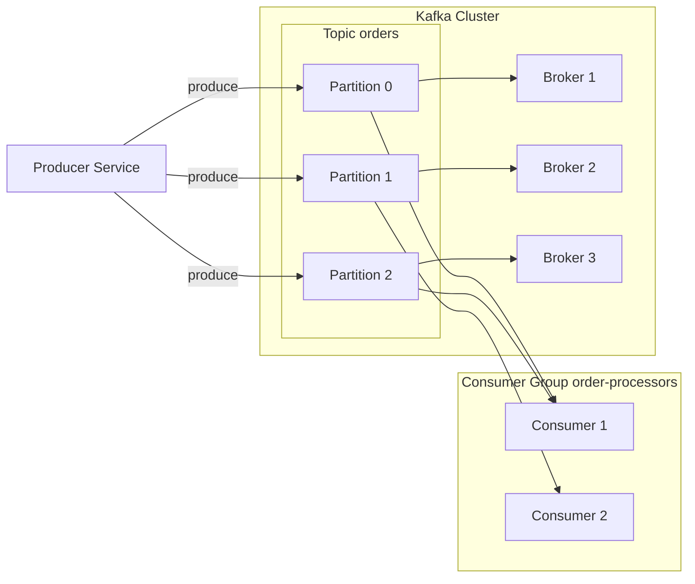

**Common interview pitfall:** saying "Kafka is just a queue." A better answer is "Kafka can be used like a queue, but its native model is a distributed log with retention and replay."

<a id="q2"></a>
### Q2: What are Kafka's key concepts?
**Answer:**

Understanding Kafka means understanding how log storage, parallelism, and consumer coordination interact.

| Concept | Deep Explanation |
|---------|------------------|
| Topic | Logical stream name; producers write to it, consumers subscribe to it |
| Partition | Ordered shard of a topic; ordering is guaranteed only inside one partition |
| Offset | Monotonic position of a record in a partition |
| Producer | Client writing records, optionally with key for deterministic partitioning |
| Consumer | Client reading records and tracking progress via committed offsets |
| Consumer Group | Consumers that share work for a topic; one partition is assigned to one consumer within a group |
| Broker | Kafka server that stores partitions and serves produce/fetch requests |
| ISR | In-sync replicas eligible for `acks=all` durability guarantees |

**Important implications:**
- Same key -> same partition -> per-key ordering.
- More consumers than partitions does not increase parallelism.
- Different consumer groups can independently read the same records.

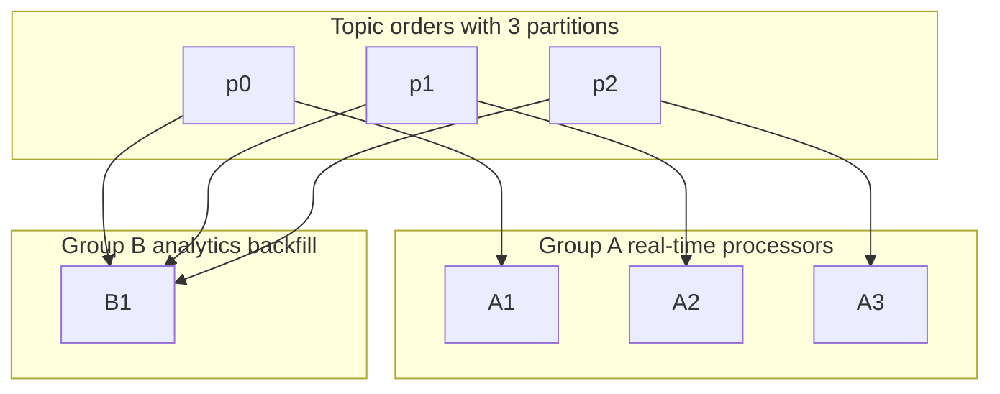

**Interview talking point:** "Kafka gives ordered processing per partition, not globally. Global ordering requires one partition, which limits throughput."

<a id="q3"></a>
### Q3: How do you use Kafka with Spring Boot?
**Answer:**

In Spring Boot, `spring-kafka` provides producer/consumer abstractions, listener containers, retry/DLT patterns, and transactional support.

**Dependency:**
```groovy
implementation 'org.springframework.kafka:spring-kafka'
```

**Production-oriented configuration (reliability first):**
```yaml
spring:
  kafka:
    bootstrap-servers: localhost:9092
    producer:
      key-serializer: org.apache.kafka.common.serialization.StringSerializer
      value-serializer: org.springframework.kafka.support.serializer.JsonSerializer
      acks: all
      retries: 2147483647
      properties:
        enable.idempotence: true
        delivery.timeout.ms: 120000
        max.in.flight.requests.per.connection: 5
    consumer:
      group-id: order-processor
      auto-offset-reset: earliest
      enable-auto-commit: false
      key-deserializer: org.apache.kafka.common.serialization.StringDeserializer
      value-deserializer: org.springframework.kafka.support.serializer.JsonDeserializer
      properties:
        spring.json.trusted.packages: "com.example.events"
        isolation.level: read_committed
    listener:
      ack-mode: manual
      concurrency: 3
```

**Producer example with async callback and metadata logging:**
```java
@Service
public class OrderEventProducer {
    private final KafkaTemplate<String, OrderEvent> template;

    public OrderEventProducer(KafkaTemplate<String, OrderEvent> template) {
        this.template = template;
    }

    public void sendOrderCreated(OrderEvent event) {
        template.send("order-events", event.orderId(), event)
            .whenComplete((result, ex) -> {
                if (ex != null) {
                    log.error("Publish failed for order {}", event.orderId(), ex);
                    return;
                }
                var meta = result.getRecordMetadata();
                log.info("Published order {} to partition {} offset {}",
                    event.orderId(), meta.partition(), meta.offset());
            });
    }
}
```

**Consumer example with manual ack and fail-fast behavior:**
```java
@Component
public class OrderEventConsumer {

    @KafkaListener(topics = "order-events", groupId = "order-processor")
    public void handle(OrderEvent event, Acknowledgment ack) {
        try {
            process(event);
            ack.acknowledge(); // commit only after successful processing
        } catch (Exception ex) {
            // Let container retry or route to DLT based on listener config
            throw ex;
        }
    }
}
```

**What strong answers include:**
- Serialization choice (JSON vs Avro/Protobuf with Schema Registry).
- Retry and dead-letter topic strategy.
- Idempotent consumer logic for at-least-once delivery.
- Partition key choice for ordering-sensitive domains.

<a id="q4"></a>
### Q4: What is the difference between Kafka and message queues?
**Answer:**

Kafka and classic message queues solve different primary problems.

| Dimension | Kafka | RabbitMQ / SQS style queue |
|-----------|-------|-----------------------------|
| Core model | Distributed log | Queue with message handoff |
| Record lifecycle | Retained by policy | Removed after ack/visibility window |
| Consumption pattern | Consumer-controlled offset pull | Broker-managed delivery semantics |
| Replay | Native | Limited / workflow-specific |
| Best fit | Event streaming and analytics pipelines | Task distribution and work queues |
| Throughput profile | Very high sustained throughput | Typically lower throughput, often lower per-message latency |

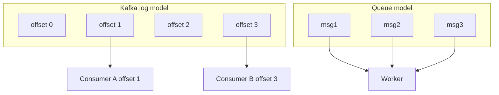

**Decision heuristic:**
- Need replay, event history, stream processing, many consumers -> Kafka.
- Need per-message routing, request/reply, straightforward task execution -> queue.

---

## Durability and Storage Semantics

<a id="q5"></a>
### Q5: How does Kafka achieve high availability with replication?
**Answer:**

Kafka replicates each partition across brokers. One replica is the leader; followers replicate from it. Writes are confirmed based on `acks` and ISR state.

**Key terms and why they matter:**

| Term | Meaning | Why It Matters |
|------|---------|----------------|
| Replication factor | Number of replicas per partition | Failure tolerance |
| Leader | Replica handling reads/writes | Primary availability endpoint |
| Follower | Replica fetching leader log | Redundancy and failover candidate |
| ISR | Followers sufficiently caught up | Durability boundary for `acks=all` |
| `min.insync.replicas` | Required ISR count for successful writes | Protects against acknowledged data loss |

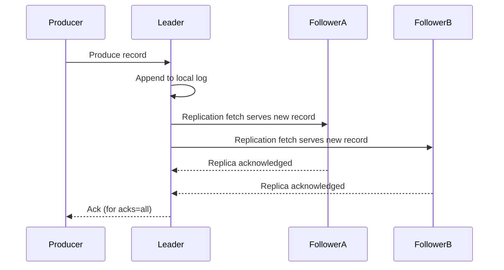

**Durability baseline in production:**
- `replication.factor=3`
- `min.insync.replicas=2`
- producer `acks=all`

**Trade-off:** with strict ISR requirements, writes can fail during multi-broker degradation. That is an intentional choice for data safety over write availability.

<a id="q6"></a>
### Q6: How do partition keys work and how do you design them?
**Answer:**

Partition keys decide both ordering scope and load distribution. Bad key design causes hot partitions and lag.

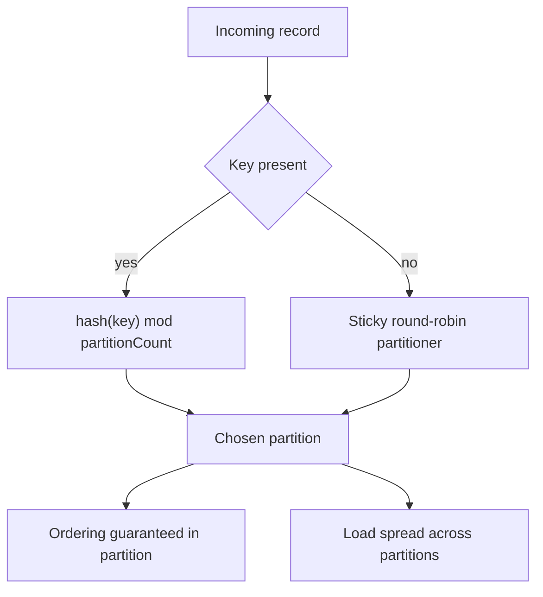

**Design principles:**
- Pick key by business entity requiring order (`orderId`, `accountId`, `userId`).
- Ensure high cardinality to avoid skew.
- Avoid low-cardinality keys (`country`, `status`) for high-volume topics.
- Revisit key strategy when traffic shape changes, not only at initial design.

**Examples:**

| Use Case | Key | Why |
|----------|-----|-----|
| Payment lifecycle | `paymentId` | Strict per-payment ordering |
| User event stream | `userId` | Consistent per-user timeline |
| Multi-tenant events | `tenantId:userId` | Tenant-scoped order + distribution |
| Metrics/log firehose | `null` key | Maximum spread when order is irrelevant |

**Practical caveat:** increasing partition count can change `hash(key) mod N`, which can shift key-to-partition mapping. Plan for this during scaling.

<a id="q7"></a>
### Q7: What is log compaction and when should you use it?
**Answer:**

Log compaction keeps the latest value per key, rather than retaining every historical value forever.

**Retention vs compaction:**

| Policy | Behavior | Typical Use |
|--------|----------|-------------|
| `delete` | Remove old segments by time/size | Event history and analytics streams |
| `compact` | Retain latest record per key | Current-state topics and changelogs |
| `compact,delete` | Keep latest keys plus bounded history | Hybrid operational workloads |

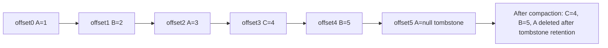

**When compaction is the right fit:**
- CDC topics where consumers need latest row state by primary key.
- Configuration topics where only current values matter.
- Kafka Streams state-store changelogs.

**Operational notes that interviewers care about:**
- Compaction is asynchronous; old records may still exist temporarily.
- Tombstones (`value=null`) must be retained long enough for downstream consumers.
- Active segment is not compacted immediately.

---

## Failures, Guarantees, and Exactly-Once

<a id="q8"></a>
### Q8: What happens when a Kafka broker fails?
**Answer:**

Kafka treats broker failure as a metadata event managed by the controller (KRaft in modern clusters). Recovery includes leader election and client metadata refresh.

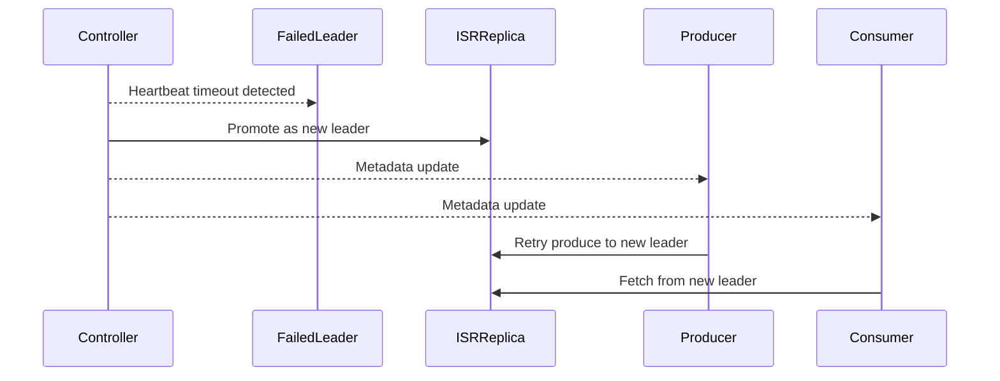

**Failure impact by role:**
- **Producers:** transient `NotLeaderOrFollower` or timeout until metadata refresh.
- **Consumers:** fetch retries and possible group rebalance if member failures also occur.
- **Cluster:** short availability dip for affected partitions during election.

**Important edge case:**
- If ISR shrinks below `min.insync.replicas`, writes with `acks=all` fail intentionally.
- `unclean.leader.election=true` increases availability but risks data loss.

**Production guidance:** tune timeouts and retries realistically; most outages are made worse by client retry storms rather than election itself.

<a id="q9"></a>
### Q9: What are the different acks settings and their trade-offs?
**Answer:**

`acks` controls when the producer considers a write successful.

| `acks` | Ack point | Durability | Throughput / Latency |
|--------|-----------|------------|----------------------|
| `0` | No broker ack | Lowest | Highest throughput, lowest latency |
| `1` | Leader append | Medium | Good balance for non-critical events |
| `all` | All ISR replicas append | Highest with `min.insync.replicas` | Higher latency, lower throughput |

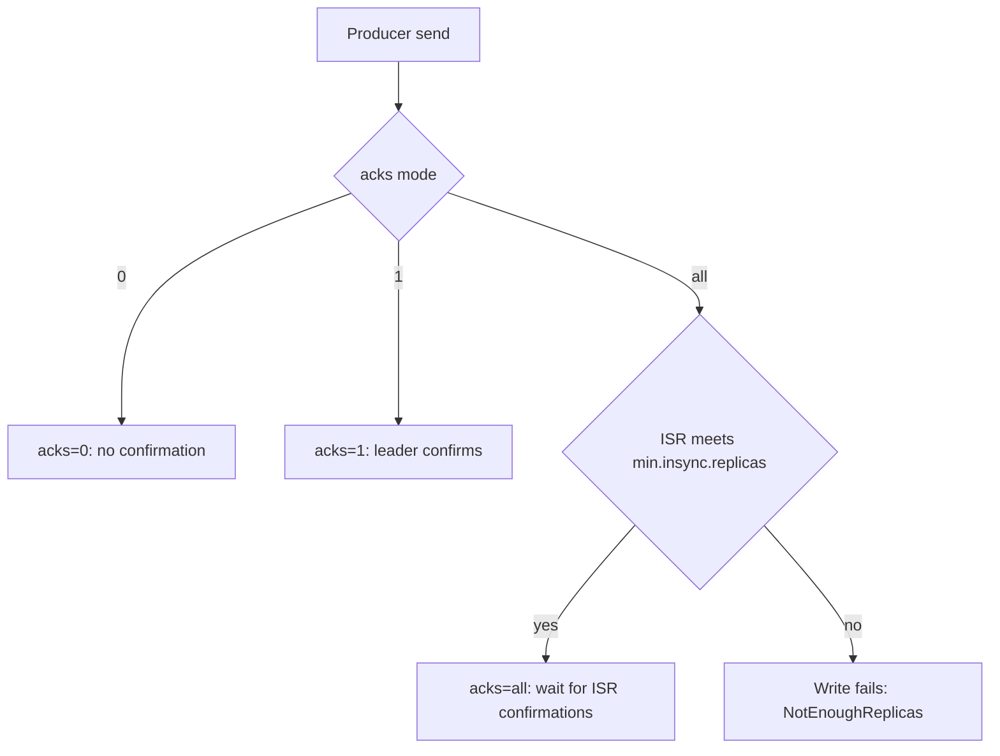

**Interview-quality recommendation matrix:**
- Logs/telemetry where minor loss is acceptable: `acks=1` (sometimes `acks=0`).
- Business events with replay tolerance: `acks=1` + idempotent consumer logic.
- Financial/critical state transitions: `acks=all` + `min.insync.replicas>=2` + idempotent producer.

**Common mistake:** using `acks=all` but leaving `min.insync.replicas=1`, which weakens durability assumptions.

<a id="q10"></a>
### Q10: How does the idempotent producer work and why is it important?
**Answer:**

Idempotent producer prevents duplicates caused by retries after uncertain delivery outcomes (for example, ack lost but write succeeded).

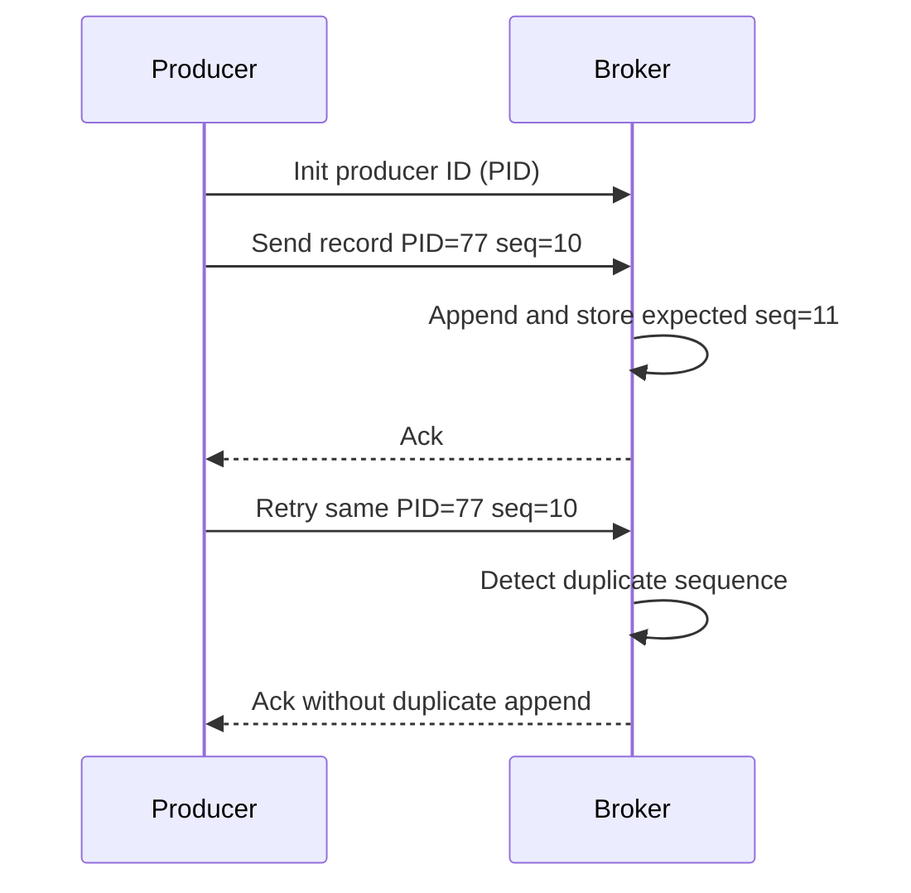

**How it works internally:**
- Broker assigns producer ID (PID).
- Producer keeps per-partition sequence numbers.
- Broker tracks last accepted sequence per PID/partition.
- Retries with old sequence are deduplicated.

**What idempotence guarantees:**
- No duplicates due to producer retries in the same producer session.
- Ordering preserved per partition with compatible in-flight settings.

**What it does not guarantee alone:**
- Cross-session or cross-partition atomicity.
- End-to-end exactly-once across consumer side effects.

**Recommended baseline config:**
```properties
enable.idempotence=true
acks=all
retries=2147483647
max.in.flight.requests.per.connection=5
```

---

## Producer and Consumer Performance and Operations

<a id="q11"></a>
### Q11: How do you tune producer for high throughput vs low latency?
**Answer:**

Producer tuning is mostly about batching, compression, inflight concurrency, and durability level.

| Parameter | Throughput-oriented | Latency-oriented | Why |
|-----------|---------------------|------------------|-----|
| `linger.ms` | Higher (for example 20-100) | 0-5 | Wait window to accumulate batch |
| `batch.size` | Larger | Smaller | Network efficiency vs flush speed |
| `compression.type` | `lz4`/`zstd` | `none`/`lz4` | CPU vs bandwidth trade-off |
| `acks` | `1` or `all` by risk | `1` usually | Confirmation cost |
| `buffer.memory` | Larger | Moderate | Absorb spikes |

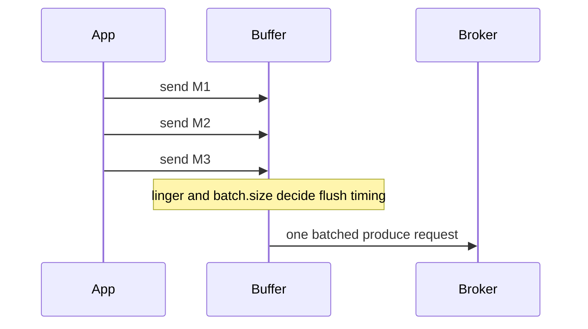

**Two profile examples:**

```properties
# High throughput profile
linger.ms=50
batch.size=65536
compression.type=lz4
acks=1
buffer.memory=67108864
```

```properties
# Low latency profile
linger.ms=0
batch.size=16384
compression.type=none
acks=1
max.in.flight.requests.per.connection=1
```

**Tuning workflow that works in production:**
1. Set SLO (p95/p99 latency and max error rate).
2. Increase batching/compression gradually.
3. Observe `request-latency-avg`, `record-error-rate`, `buffer-available-bytes`.
4. Rebalance when either latency SLO or broker pressure regresses.

<a id="q12"></a>
### Q12: How do you handle consumer offset management?
**Answer:**

Offset management defines delivery semantics more than almost any other consumer setting.

**Core rules:**
- Commit after successful processing for at-least-once.
- Commit before processing for at-most-once (rare for critical data).
- For exactly-once pipelines, commit offsets in transaction with produced output.

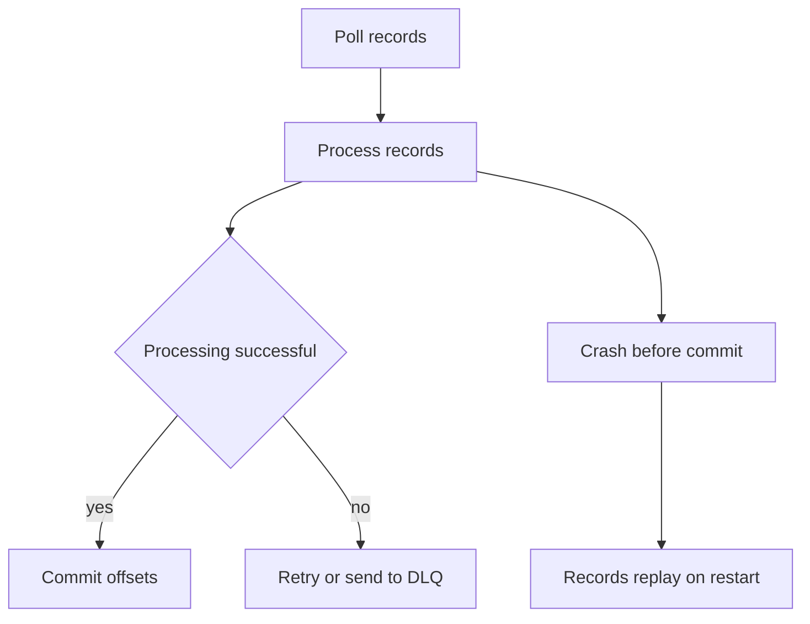

**Commit strategies:**

| Strategy | Pros | Cons | Typical Use |
|----------|------|------|-------------|
| Auto commit | Simple | Can lose unprocessed records | Non-critical consumers |
| `commitSync()` | Stronger safety | Higher latency | Critical pipelines |
| `commitAsync()` | Better throughput | Commit error handling complexity | High-throughput consumers |
| Per-batch commit | Good balance | Possible duplicate batch replay | Most production services |

**Rebalance-safe pattern:**
```java
while (running) {
    var records = consumer.poll(Duration.ofMillis(500));
    processBatch(records);
    consumer.commitSync();
}
```

**Important timeout alignment:** ensure processing time stays under `max.poll.interval.ms`, otherwise group coordinator evicts the consumer and triggers rebalances.

<a id="q13"></a>
### Q13: What is consumer lag and how do you handle it?
**Answer:**

Consumer lag = `logEndOffset - committedOffset` per partition. Growing lag means consumers cannot keep up with produce rate.

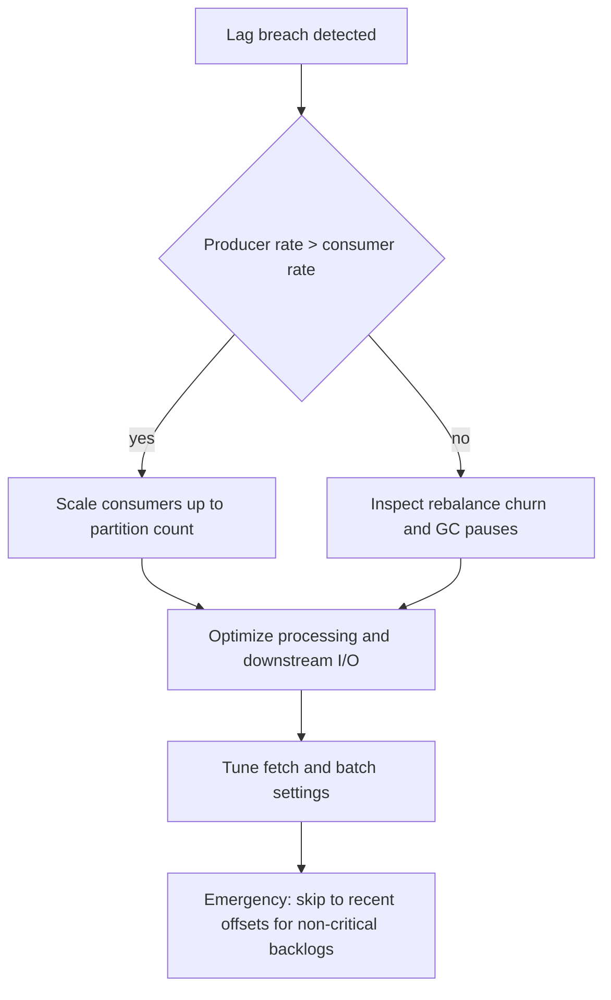

**Typical root causes:**
- Under-provisioned consumer instances.
- Slow downstream systems (DB/API bottlenecks).
- Frequent rebalances and long stop-the-world pauses.
- Hot partitions due to poor key distribution.

**Metrics to watch together (not in isolation):**
- `records-lag-max`
- `records-consumed-rate`
- `fetch-latency-avg`
- rebalance frequency and duration

**Operational guidance:**
- Scale partition count and consumer count together over time.
- Implement backpressure and pause/resume when downstream fails.
- Use lag-based autoscaling with guardrails to avoid oscillation.

<a id="q14"></a>
### Q14: What are the partition assignment strategies?
**Answer:**

Assignment strategy defines how partitions are distributed in a consumer group and how disruptive rebalances are.

| Strategy | Distribution | Rebalance Cost | Good For |
|----------|--------------|----------------|----------|
| Range | Can be uneven | High | Partition-number locality across topics |
| RoundRobin | Even | High | Simple balanced stateless workloads |
| Sticky | Even and stable | Medium | Stateful consumers with local caches |
| CooperativeSticky | Even and incremental | Low | Most production groups |

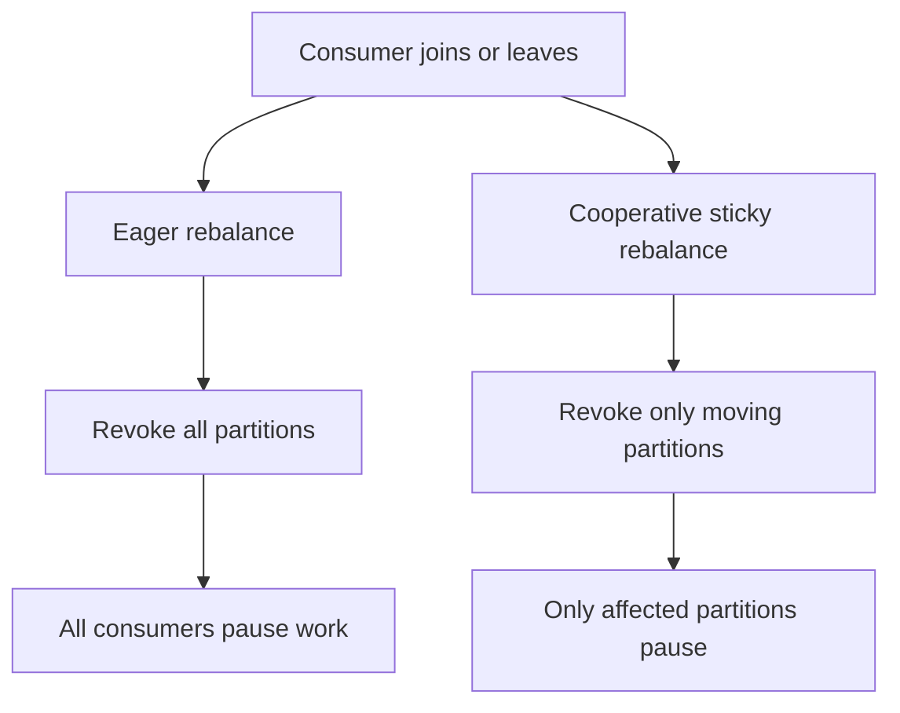

**Advanced production knobs:**
- `partition.assignment.strategy=org.apache.kafka.clients.consumer.CooperativeStickyAssignor`
- `group.instance.id` for static membership to reduce churn on rolling deploys.

**Interview nuance:** strategy choice is not only about fairness; it is also about minimizing movement cost and cache warmup penalties.

---

## Failures, Guarantees, and Exactly-Once (continued)

<a id="q15"></a>
### Q15: How do Kafka transactions work for exactly-once semantics?
**Answer:**

Kafka transactions atomically combine multiple writes and optional consumer offset commits, enabling exactly-once processing in consume-transform-produce pipelines.

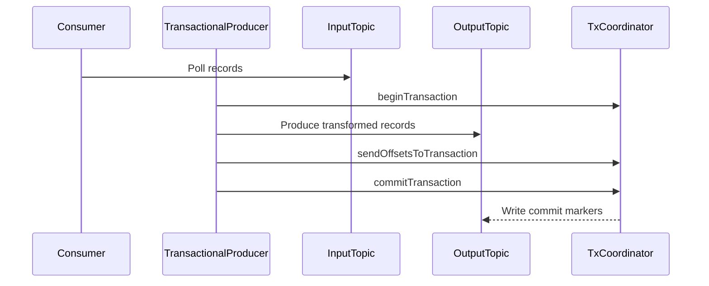

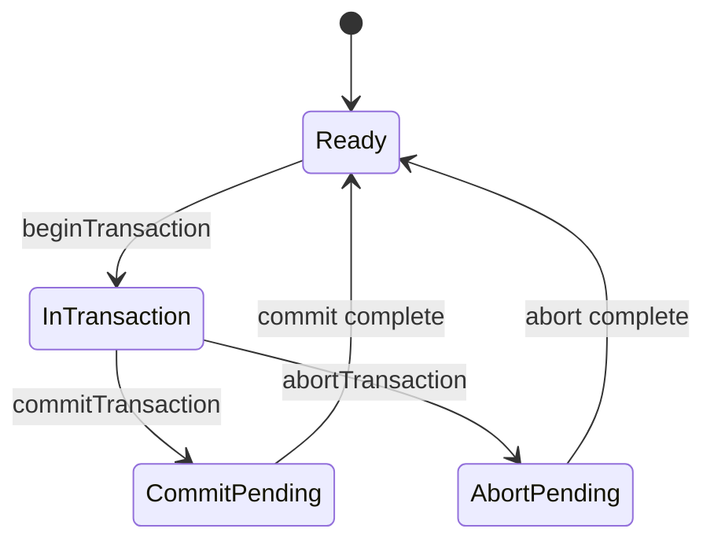

**Required settings:**
```properties
# Producer
transactional.id=orders-tx-producer-1
enable.idempotence=true
acks=all

# Consumer
isolation.level=read_committed
```

**What this guarantees:**
- Output records and consumed offsets are committed together or not at all.
- Consumers with `read_committed` do not see aborted records.

**Trade-offs:**
- Extra latency and coordinator overhead.
- Need strong operational discipline around producer identity and transaction timeouts.

---

## Schema, Security, and Observability

<a id="q16"></a>
### Q16: What is Schema Registry and why is it important?
**Answer:**

Schema Registry centralizes schema definitions and compatibility checks so producers and consumers can evolve independently without breaking each other.

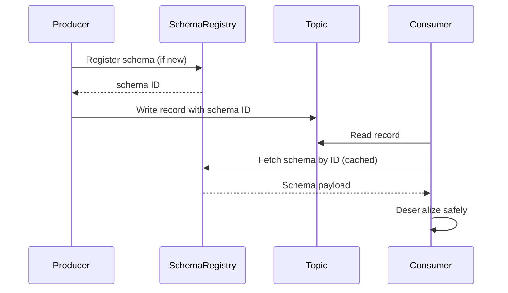

**Why it matters in real teams:**
- Prevents accidental breaking changes during independent deploys.
- Reduces payload size with binary formats (Avro/Protobuf).
- Provides auditable schema history.

**Compatibility modes (simplified):**

| Mode | Safe Direction | Typical Rule |
|------|----------------|--------------|
| BACKWARD | New consumer reads old data | Add optional fields with defaults |
| FORWARD | Old consumer reads new data | Avoid removing required fields abruptly |
| FULL | Both directions | Strictest contract discipline |
| NONE | No check | Local/dev only |

**Rollout best practice:**
1. Use backward-compatible change first.
2. Deploy consumers before producers for additive fields.
3. Monitor deserialization failures as release health signal.

<a id="q17"></a>
### Q17: How do you configure Kafka security?
**Answer:**

Kafka security is a combination of encryption, authentication, and authorization. All three are needed in production.

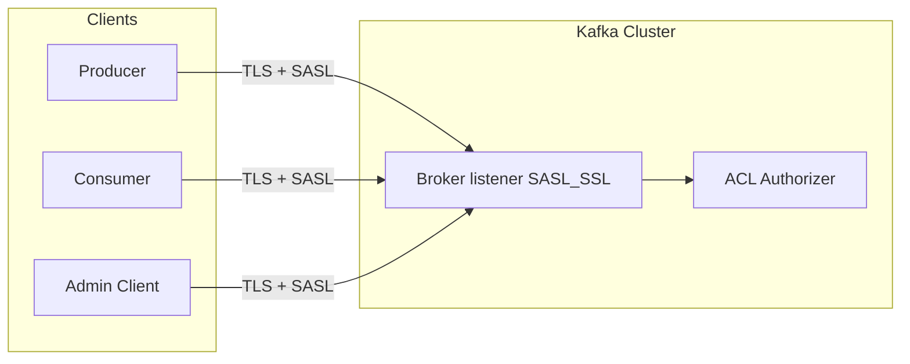

**Recommended production baseline:**
- Transport: `SASL_SSL` (TLS + identity)
- Auth mechanism: SCRAM-SHA-256/512 or mTLS/Kerberos depending on environment
- Authorization: ACLs with least privilege
- Secrets: external secret manager + rotation policy

**Example settings:**
```properties
# Broker
listeners=SASL_SSL://0.0.0.0:9093
sasl.enabled.mechanisms=SCRAM-SHA-512
authorizer.class.name=org.apache.kafka.metadata.authorizer.StandardAuthorizer
allow.everyone.if.no.acl.found=false

# Client
security.protocol=SASL_SSL
sasl.mechanism=SCRAM-SHA-512
```

**ACL examples:**
```bash
# Producer write permission
kafka-acls.sh --add --allow-principal User:producer1 --operation Write --topic orders

# Consumer read permission
kafka-acls.sh --add --allow-principal User:consumer1 --operation Read --topic orders --group order-processors
```

**Common mistake:** enabling TLS but keeping broad wildcard ACLs, which leaves data exposed to authenticated-but-unauthorized principals.

<a id="q18"></a>
### Q18: What are the key Kafka metrics to monitor?
**Answer:**

You need a layered view: cluster health, broker performance, producer health, consumer lag, and infrastructure saturation.

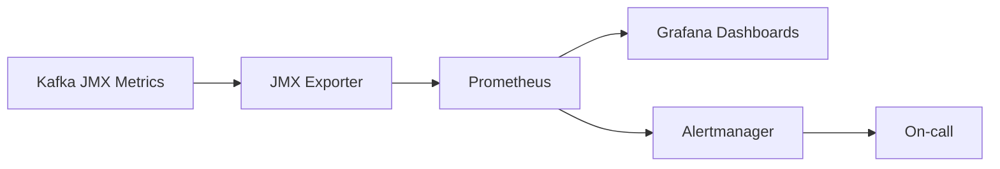

**Critical cluster metrics:**

| Metric | Why It Matters | Alert Hint |
|--------|----------------|-----------|
| `UnderReplicatedPartitions` | Replica safety degraded | Alert when > 0 for sustained period |
| `OfflinePartitionsCount` | Data unavailable for some partitions | Critical when > 0 |
| `ActiveControllerCount` | Controller health | Should be exactly 1 |
| Request latency (`TotalTimeMs` by API) | End-user impact | Alert on p95/p99 SLO breach |

**Producer/consumer metrics:**

| Layer | Metrics |
|-------|---------|
| Producer | `record-error-rate`, `request-latency-avg`, `record-retry-rate`, `buffer-available-bytes` |
| Consumer | `records-lag-max`, `fetch-latency-avg`, `records-consumed-rate`, rebalance duration |

**SLO-driven monitoring approach:**
1. Define service SLOs (delivery latency, data freshness, loss tolerance).
2. Map SLOs to Kafka and app metrics.
3. Alert on sustained symptoms, not single spikes.
4. Add runbooks for top incidents (lag growth, ISR shrink, broker down).

---

Good luck with your interview!
